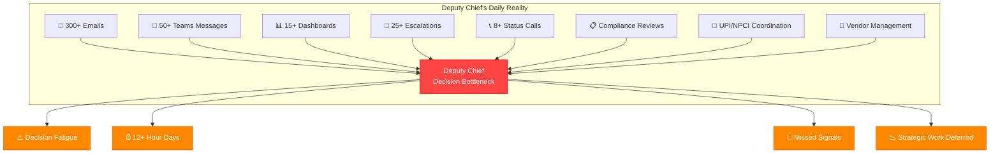
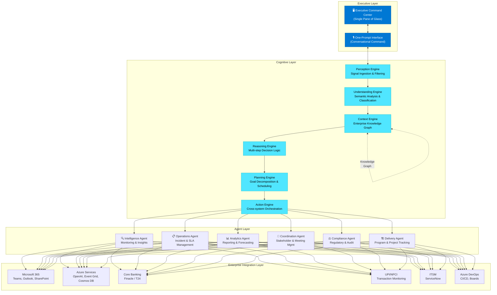
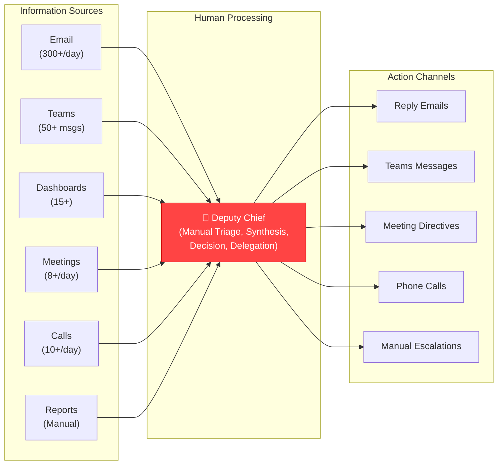
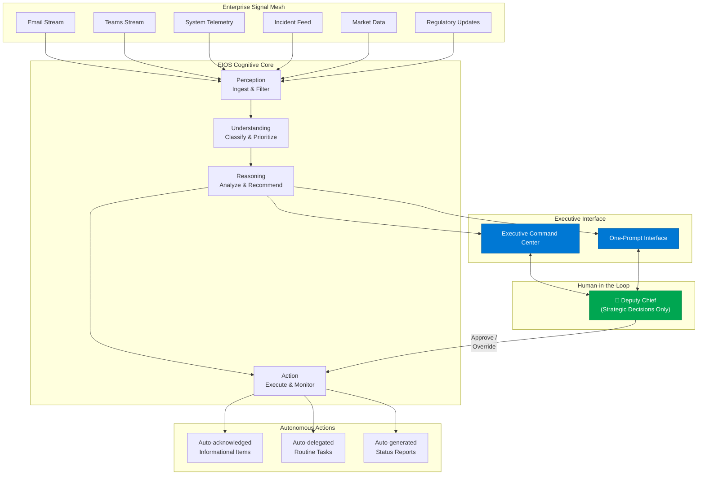
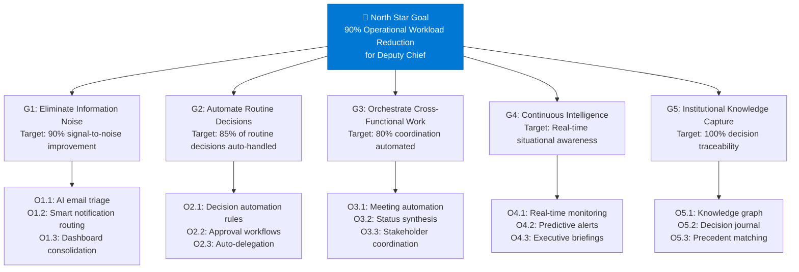
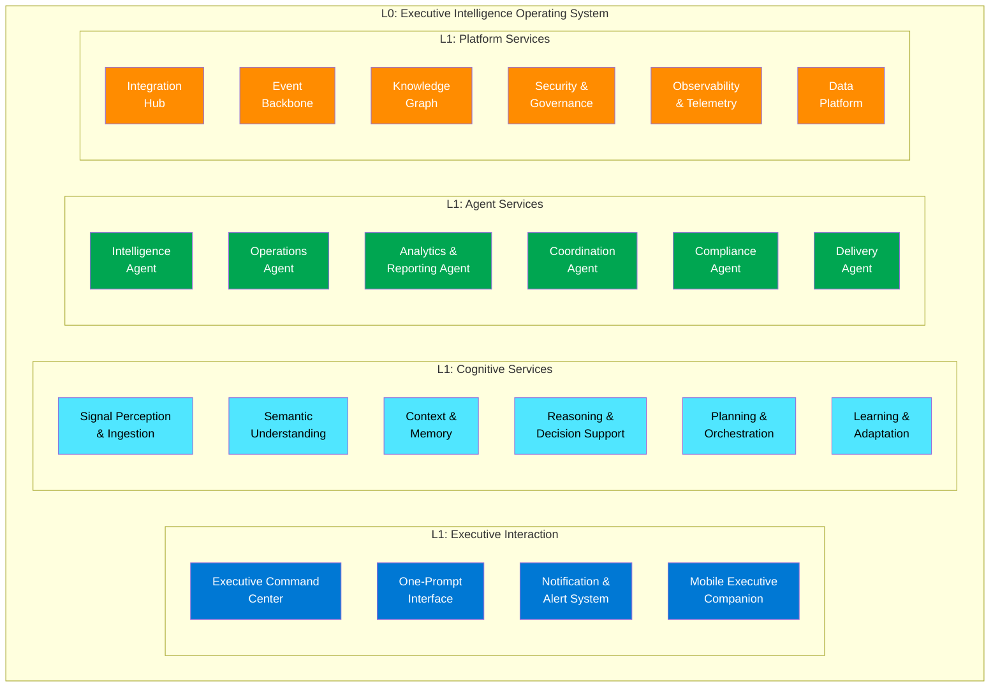
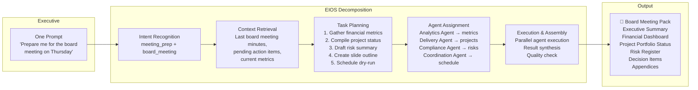
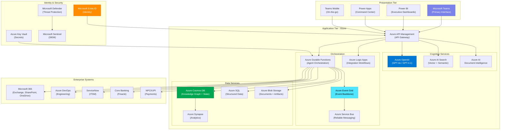
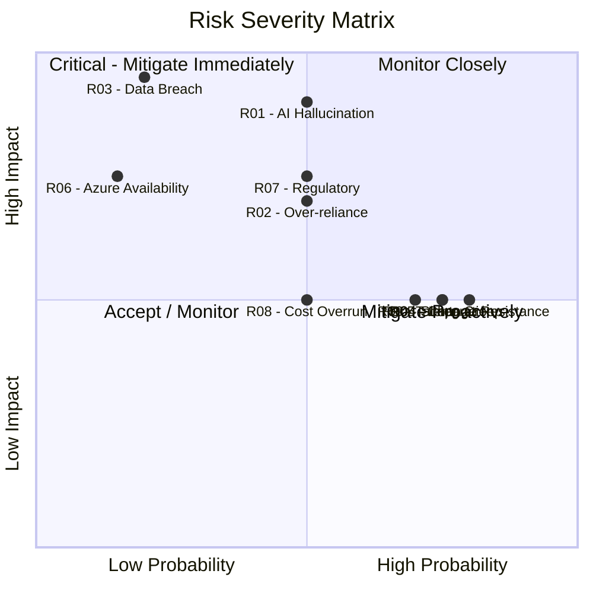
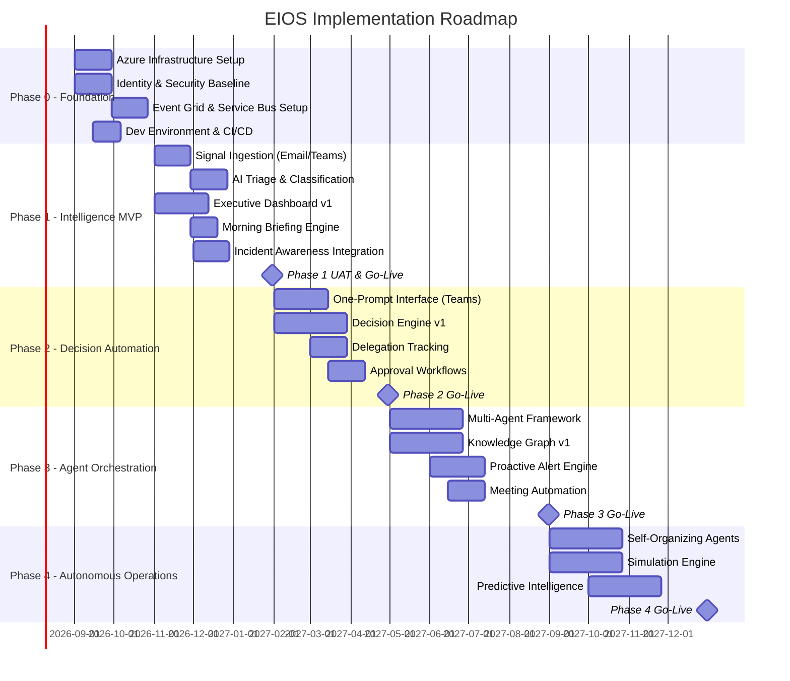

# EIOS Volume 1 — Product Vision

## Executive Intelligence Operating System (EIOS)

**Volume 1 of 7 | Classification: Internal — Architecture Review Board**

**Version:** 1.0  
**Date:** July 2026  
**Author:** Principal Enterprise AI Architecture Team  
**Status:** Draft for ARB Review  
**Distribution:** CTO, CIO, Deputy Chief (Operations), Architecture Review Board, Enterprise Architecture Council

---

## Document Control

| Field | Value |
|---|---|
| Document ID | EIOS-VOL1-2026-001 |
| Version | 1.0 |
| Last Updated | July 2026 |
| Review Cycle | Quarterly |
| Classification | Internal — Restricted |
| Related Volumes | Vol 2: Business Architecture, Vol 3: Cognitive & AI Architecture, Vol 4: Enterprise Technical Architecture, Vol 5: Engineering & Implementation Playbook, Vol 6: UX, Dashboards & Interaction, Vol 7: Governance, Security & Operations |

---

# Chapter 1 — Executive Summary

## 1.1 Purpose

This document establishes the product vision for the **Executive Intelligence Operating System (EIOS)** — a Microsoft-first, AI-native platform designed to transform how the Deputy Chief of Operations at a Tier-1 Indian bank manages daily executive workflows. EIOS is not another copilot or chatbot overlay. It is a **cognitive operating system** that perceives, reasons, plans, and acts across the entire enterprise landscape on behalf of the executive, with full human-in-the-loop governance.

## 1.2 The Transformation Promise

| Metric | Current State | EIOS Target | Improvement |
|---|---|---|---|
| Daily operational overhead | ~12 hours | ~1.2 hours | **90% reduction** |
| Decision latency (routine) | 4–48 hours | < 5 minutes | **98% faster** |
| Information synthesis time | 2–3 hours/day | Real-time, proactive | **~100% automated** |
| Cross-functional coordination | 15–20 manual touchpoints/day | Autonomous orchestration | **85% reduction** |
| Missed escalation rate | ~12% | < 1% | **92% improvement** |
| Report preparation time | 3–5 hours/week | Auto-generated, continuous | **95% reduction** |

## 1.3 Key Architectural Decisions

> [!IMPORTANT]
> **ADR-001**: EIOS will be built entirely on the Microsoft ecosystem — Azure OpenAI Service, Microsoft 365, Power Platform, Azure Event Grid, Cosmos DB, and Microsoft Entra ID. No third-party AI providers or non-Microsoft identity systems will be used in the core platform.

> [!IMPORTANT]
> **ADR-002**: All AI-driven actions that carry material risk (financial, regulatory, reputational) will require explicit human approval before execution. The system implements a three-tier autonomy model: Autonomous, Supervised, and Human-Required.

## 1.4 Intended Audience

This document is intended for:
- **Executive Leadership**: CTO, CIO, Deputy Chief — to validate vision alignment with strategic objectives
- **Architecture Review Board**: To assess architectural feasibility, risk, and compliance
- **Product Leadership**: To translate vision into a phased delivery roadmap
- **Engineering Leadership**: To understand scope, constraints, and technical direction
- **Security & Compliance**: To evaluate governance model and regulatory alignment (detailed in Volume 7)

---

# Chapter 2 — Problem Statement

## 2.1 The Executive Workload Crisis

The Deputy Chief of Operations at a Tier-1 Indian bank operates at the intersection of technology delivery, regulatory compliance, operational risk management, and digital transformation. This role has become unsustainable.

### 2.1.1 Quantified Pain Points

| Pain Point | Quantified Impact | Root Cause |
|---|---|---|
| **Information Overload** | 300+ emails/day, 50+ Teams messages, 15+ dashboards | Fragmented communication across siloed platforms |
| **Decision Fatigue** | 40–60 decisions/day across 8+ domains | No decision-support system; each decision requires manual synthesis |
| **Coordination Tax** | 3–4 hours/day in status meetings | No unified real-time view of cross-functional programs |
| **Escalation Avalanche** | 15–25 escalations/day, 60% are informational | No intelligent triage; everything escalates to the top |
| **Reporting Burden** | 5–8 hours/week preparing board materials | Manual data aggregation from 12+ source systems |
| **Context Switching** | 80+ application switches/day | No single pane of glass; fragmented toolchain |
| **Compliance Anxiety** | 2–3 hours/week on audit preparation | Manual evidence collection; no continuous compliance |

### 2.1.2 The Banking Context

In the Indian banking ecosystem, the Deputy Chief's burden is amplified by:

- **UPI Scale**: Processing 12+ billion transactions/month with 99.95% uptime SLAs requires constant vigilance
- **RBI Regulatory Pressure**: Frequent regulatory changes (e.g., Digital Personal Data Protection Act 2023, RBI IT Governance Framework 2023) demand rapid compliance responses
- **Multi-Channel Complexity**: Branch, mobile, internet banking, UPI, IMPS, NEFT, RTGS, BBPS, AePS — each with distinct operational requirements
- **Vendor Ecosystem**: 200+ technology vendors requiring contract management, SLA monitoring, and risk assessment
- **Incident Velocity**: 50–100 P3+ incidents/week across channels requiring executive awareness



## 2.2 The Systemic Failure Pattern

The current operating model follows a **hub-and-spoke anti-pattern** where the Deputy Chief is the central processing node for all information flow. This creates:

1. **Single Point of Failure**: Executive unavailability (travel, leave, illness) paralyzes decision-making
2. **Latency Amplification**: Every decision queues behind the executive's cognitive bandwidth
3. **Institutional Knowledge Lock-in**: Critical context lives in the executive's head, not in systems
4. **Burnout Risk**: Unsustainable workload leads to diminished decision quality over time

> [!WARNING]
> **Risk Assessment**: Based on industry benchmarks, executives operating at this cognitive load level exhibit a 35–40% decline in decision quality by mid-afternoon. For a bank processing ₹15+ lakh crore annually through digital channels, even marginal decision degradation creates material risk.

---

# Chapter 3 — Why Traditional Copilots Are Insufficient

## 3.1 The Copilot Limitation Matrix

| Capability | Generic Copilot | Enterprise Copilot (M365) | EIOS |
|---|---|---|---|
| **Scope** | Single-application | Single-tenant, multi-app | Enterprise-wide, cross-system |
| **Context** | Current document/conversation | M365 graph data | Full enterprise context + memory |
| **Autonomy** | Responds to prompts | Responds to prompts | Proactive + autonomous (with guardrails) |
| **Memory** | Session-only | Limited cross-session | Persistent institutional memory |
| **Reasoning** | Single-step | Single-step | Multi-step, multi-agent |
| **Integration** | Native app only | M365 ecosystem | All enterprise systems via API mesh |
| **Decision Support** | Information retrieval | Information retrieval + summarization | Full decision lifecycle management |
| **Governance** | Basic content filtering | Sensitivity labels | Enterprise-grade RBAC + ABAC + audit |
| **Domain Knowledge** | Generic | Generic + tenant data | Banking domain-specific + regulatory |
| **Learning** | None | Minimal | Continuous from executive feedback |

## 3.2 The Five Gaps

### Gap 1: Proactivity
Traditional copilots are reactive — they wait for prompts. EIOS **anticipates** the executive's needs by continuously monitoring enterprise signals, detecting patterns, and proactively surfacing insights.

**Example (Banking)**: A copilot can answer "What's the UPI success rate today?" EIOS detects that UPI success rate dropped 0.3% in the last 90 minutes, correlates it with a specific PSP's (Payment Service Provider) degradation, checks the SLA thresholds, drafts an escalation to the NPCI operations team, and presents it for the Deputy Chief's approval — all before the executive is even aware of the issue.

### Gap 2: Multi-System Orchestration
Copilots operate within their application boundary. EIOS orchestrates actions across Azure DevOps, ServiceNow, SAP, core banking, NPCI APIs, and internal microservices — treating the entire enterprise as a single programmable surface.

### Gap 3: Institutional Memory
Copilots have no persistent memory of past decisions, outcomes, or executive preferences. EIOS maintains a **knowledge graph** of decisions, their context, outcomes, and the executive's evolving reasoning patterns — building institutional intelligence that persists beyond any individual.

### Gap 4: Decision-Grade Reasoning
Copilots perform single-step retrieval-augmented generation. EIOS performs **multi-step reasoning** — decomposing complex decisions into sub-problems, running simulations, evaluating trade-offs, and presenting options with confidence scores and risk assessments.

### Gap 5: Autonomous Execution
Copilots produce text outputs. EIOS can **execute** approved actions — updating JIRA tickets, sending Teams messages, scheduling meetings, triggering CI/CD pipelines, creating ServiceNow incidents, and adjusting capacity configurations — all under human-in-the-loop governance.

> [!TIP]
> **Positioning**: EIOS is not a replacement for Microsoft 365 Copilot. It is a **higher-order orchestration layer** that leverages M365 Copilot as one of many capabilities within its cognitive architecture. Think of M365 Copilot as a skilled individual contributor; EIOS is the executive who delegates, coordinates, and governs.

---

# Chapter 4 — Vision

## 4.1 The EIOS North Star

**"One executive. One command center. One prompt. Zero operational drag."**

EIOS transforms the Deputy Chief from a **human router** (manually processing information and coordinating actions) into a **strategic decision-maker** (approving AI-synthesized recommendations and focusing on high-value judgment calls).

## 4.2 Vision Architecture



## 4.3 Core Vision Tenets

| # | Tenet | Description | Design Implication |
|---|---|---|---|
| T1 | **90% Workload Reduction** | EIOS must measurably reduce the Deputy Chief's operational time from 12 hours to 1.2 hours | Every feature must quantify its workload reduction contribution |
| T2 | **Microsoft-First** | All core capabilities built on Azure + M365 | No third-party AI, no non-Microsoft identity providers in core platform |
| T3 | **Human-in-the-Loop** | All material decisions require human approval | Three-tier autonomy model: Autonomous / Supervised / Human-Required |
| T4 | **Event-Driven** | The system reacts to enterprise events, not just prompts | Azure Event Grid as the nervous system; no polling |
| T5 | **Single Command Center** | One unified interface for all executive operations | Consolidated dashboard + conversational UI in Teams |
| T6 | **One-Prompt Philosophy** | Any executive intent expressible in a single natural language command | Multi-agent decomposition behind a single conversational interface |
| T7 | **Institutional Memory** | The system learns and retains organizational knowledge | Persistent knowledge graph with decision history and outcomes |
| T8 | **Banking-Grade Security** | RBI-compliant, audit-ready, zero-trust architecture | Detailed in Volume 7: Governance, Security & Operations |

---

# Chapter 5 — Personas

## 5.1 Primary Persona: The Deputy Chief

| Attribute | Detail |
|---|---|
| **Title** | Deputy Chief (Operations & Technology) |
| **Organization** | Tier-1 Indian Private Sector Bank |
| **Reports To** | CTO / COO |
| **Direct Reports** | 8–12 department heads |
| **Span of Control** | ~2,500 technology staff (direct + vendor) |
| **Key Responsibilities** | Technology operations, digital banking, UPI infrastructure, vendor management, IT compliance, program delivery |
| **Pain Points** | Information overload, decision fatigue, coordination overhead, compliance anxiety |
| **Tech Savviness** | High — comfortable with dashboards, data-driven, prefers concise insights over raw data |
| **Communication Preference** | Microsoft Teams (primary), Email (formal), WhatsApp (urgent personal) |
| **Work Hours** | 8:00 AM – 9:00 PM IST (frequently extended) |
| **EIOS Interaction Model** | Voice + text via Teams; Executive Command Center dashboard on desktop/tablet |

## 5.2 Secondary Personas

| Persona | Role | EIOS Interaction | Key Need |
|---|---|---|---|
| **Department Heads** | VP/SVP-level direct reports | Receive AI-orchestrated delegations; provide status updates consumed by EIOS | Clarity on priorities; reduced upward reporting |
| **Chief of Staff** | Executive assistant / coordination | Monitors EIOS actions; handles exceptions | Visibility into what EIOS is doing on behalf of the Deputy Chief |
| **CTO / COO** | Superior executive | Receives EIOS-generated summaries and escalations | Confidence that operations are governed |
| **Audit & Compliance** | Internal audit team | Reviews EIOS audit trails and decision logs | Complete traceability of AI-assisted decisions |
| **IT Operations** | NOC / Command Center teams | Feed incident data into EIOS; receive executive directives | Faster executive response to critical incidents |

## 5.3 Anti-Personas

> [!CAUTION]
> EIOS is **not** designed for the following users in its initial deployment:
> - **Front-line staff**: Branch employees, call center agents — they use separate operational tools
> - **External customers**: EIOS is an internal executive system; no customer-facing interfaces
> - **Board members**: Board reporting is an output of EIOS, but board members are not direct users
> - **Third-party vendors**: Vendors interact with EIOS outputs (e.g., escalation emails) but not the system directly

---

# Chapter 6 — Current vs. Future Operating Model

## 6.1 Current State: The Human Router Model



**Current State Characteristics:**
- Executive is the **central processing unit** — all information flows through them
- **No filtering**: Signal-to-noise ratio is approximately 1:10
- **No persistence**: Decisions and rationale live in the executive's memory
- **No automation**: Every action requires manual execution
- **No proactivity**: All responses are reactive

## 6.2 Future State: The AI-Augmented Executive Model



## 6.3 Operating Model Comparison

| Dimension | Current State | Future State (EIOS) | Delta |
|---|---|---|---|
| **Information Triage** | Manual — executive reads everything | AI-filtered — only actionable items surface | 90% noise reduction |
| **Decision Support** | Gut feel + scattered data | AI-synthesized briefing with options, risks, recommendations | From intuition to intelligence |
| **Delegation** | Verbal / email instructions | AI-orchestrated task assignment with tracking | 100% traceability |
| **Status Tracking** | Pull-based (ask for updates) | Push-based (EIOS monitors and alerts) | Proactive vs. reactive |
| **Reporting** | Manual aggregation (5–8 hrs/week) | Continuous auto-generation | 95% time savings |
| **Escalation Management** | Everything escalates up | Intelligent triage — only material items reach executive | 85% reduction in escalations |
| **Institutional Knowledge** | In the executive's head | In the EIOS knowledge graph | Persistent, transferable |
| **After-Hours Coverage** | Executive is always on | EIOS monitors; wakes executive only for critical items | Work-life balance restored |

---

# Chapter 7 — Cognitive Load Analysis

## 7.1 Cognitive Load Framework

EIOS applies cognitive load theory to systematically identify and reduce the three types of cognitive load on the Deputy Chief:

| Load Type | Definition | Current Sources | EIOS Mitigation |
|---|---|---|---|
| **Intrinsic** | Complexity inherent to the task itself | Multi-domain decisions (tech + business + regulatory) | Decision decomposition; domain-specific agents provide pre-analyzed briefs |
| **Extraneous** | Load caused by poor information design | 15+ dashboards, 300+ emails, context switching | Single Command Center; AI-curated information flow |
| **Germane** | Productive load that builds expertise | Learning from decision outcomes; pattern recognition | EIOS captures decision-outcome pairs; surfaces relevant precedents |

## 7.2 Cognitive Load Heat Map

| Activity | Hours/Day | Cognitive Intensity | EIOS Automation Potential | Post-EIOS Hours |
|---|---|---|---|---|
| Email triage & response | 2.5 | Medium | 90% | 0.25 |
| Status meetings | 3.0 | Low-Medium | 80% (async status via EIOS) | 0.60 |
| Escalation handling | 2.0 | High | 70% (intelligent triage) | 0.60 |
| Report preparation | 1.0 | Medium | 95% | 0.05 |
| Decision-making (routine) | 1.5 | High | 85% (auto-approve low-risk) | 0.22 |
| Decision-making (strategic) | 1.0 | Very High | 20% (augment, not automate) | 0.80 |
| Vendor coordination | 0.5 | Medium | 75% | 0.12 |
| Compliance review | 0.5 | High | 60% | 0.20 |
| **Total** | **12.0** | | | **~2.8** |

> [!NOTE]
> **Revised Target**: The initial 90% reduction target (12 → 1.2 hours) is aspirational for the fully mature system (Phase 4+). Realistic Phase 1 target is **12 → 6 hours (50% reduction)**, progressing to **12 → 2.8 hours (77%)** by Phase 3, and approaching **12 → 1.5 hours (87%)** by Phase 5 with full agent autonomy.

---

# Chapter 8 — Design Principles

## 8.1 Foundational Principles

| # | Principle | Description | Implementation Guideline |
|---|---|---|---|
| DP-01 | **Human Sovereignty** | The executive retains ultimate authority over all decisions. AI advises; humans decide. | Every AI action is reversible. Every AI recommendation includes "Why" reasoning. Override is always one click away. |
| DP-02 | **Progressive Autonomy** | The system earns trust incrementally. Autonomy expands as confidence is validated. | Start with 100% supervised. Graduate to autonomous only after consistent accuracy over defined thresholds. |
| DP-03 | **Transparency by Default** | Every AI action, recommendation, and reasoning chain is fully explainable and auditable. | All decisions logged with full context. "Show me why" available for every recommendation. |
| DP-04 | **Event-Driven, Not Poll-Driven** | The system reacts to enterprise events in real-time rather than periodic batch processing. | Azure Event Grid as backbone. Webhooks over polling. Sub-second event propagation. |
| DP-05 | **Microsoft-First, Microsoft-Native** | Leverage Microsoft ecosystem natively rather than building parallel infrastructure. | Use Azure OpenAI (not OpenAI direct), Graph API (not custom connectors), Entra ID (not custom auth). |
| DP-06 | **Composable Architecture** | Every capability is a modular, independently deployable unit that can be assembled into workflows. | Microservices architecture. Each agent is independently versionable and deployable. |
| DP-07 | **Banking-Grade Resilience** | The system must meet the same availability and recoverability standards as core banking infrastructure. | 99.95% uptime SLA. RPO < 5 min. RTO < 15 min. Active-active where possible. |
| DP-08 | **Privacy by Design** | Personal and sensitive data is protected at every layer, compliant with DPDPA 2023 and RBI guidelines. | Data classification at ingestion. Field-level encryption. Purpose limitation. Detailed in Volume 7. |
| DP-09 | **Graceful Degradation** | If AI capabilities are unavailable, the system falls back to rule-based automation, then to manual workflows. | Circuit breakers on all AI calls. Fallback chains defined for every critical path. |
| DP-10 | **Measurable Impact** | Every feature must demonstrate quantifiable workload reduction. No "nice to have" features in MVP. | OKR-linked feature prioritization. Workload reduction metrics tracked per capability. |

---

# Chapter 9 — Goals & Objectives

## 9.1 Strategic Goals



## 9.2 OKR Framework

| Goal | Objective | Key Result | Timeline |
|---|---|---|---|
| G1 | Eliminate information noise | KR1: < 30 actionable items surfaced/day (from 300+) | Phase 1 (Q4 2026) |
| G1 | | KR2: Executive spends < 30 min/day on email | Phase 2 (Q1 2027) |
| G2 | Automate routine decisions | KR1: 50% of routine approvals auto-handled | Phase 2 |
| G2 | | KR2: 85% auto-handled with < 2% override rate | Phase 3 (Q2 2027) |
| G3 | Orchestrate coordination | KR1: Status meetings reduced by 50% | Phase 1 |
| G3 | | KR2: 80% of delegations tracked end-to-end | Phase 2 |
| G4 | Continuous intelligence | KR1: Executive briefing auto-generated at 7:30 AM daily | Phase 1 |
| G4 | | KR2: Predictive alerts with > 80% accuracy | Phase 3 |
| G5 | Knowledge capture | KR1: 100% of EIOS-facilitated decisions logged | Phase 1 |
| G5 | | KR2: Precedent matching available for 50% of decision types | Phase 3 |

---

# Chapter 10 — Business Outcomes

## 10.1 Value Realization Framework

| Business Outcome | Metric | Baseline | Target | Value |
|---|---|---|---|---|
| **Executive Productivity** | Hours saved per week | 0 | 50+ hours | ₹2.5 Cr/year in executive time value |
| **Decision Velocity** | Median decision time (routine) | 4 hours | 5 minutes | Faster market response |
| **Incident Response** | Time to executive awareness | 45 minutes | 2 minutes | Reduced MTTR; lower operational loss |
| **Compliance Posture** | Audit preparation time | 120 hours/quarter | 8 hours/quarter | 93% reduction; improved audit scores |
| **Operational Risk** | Missed escalation rate | 12% | < 1% | Reduced regulatory and financial risk |
| **Stakeholder Satisfaction** | Direct report satisfaction score | 3.2/5 | 4.5/5 | Improved team morale and retention |
| **Knowledge Continuity** | Decision context captured | ~5% | 100% | Executive transition risk eliminated |

## 10.2 ROI Model (3-Year)

| Category | Year 1 | Year 2 | Year 3 | Total |
|---|---|---|---|---|
| **Investment** | | | | |
| Platform development | ₹8 Cr | ₹5 Cr | ₹3 Cr | ₹16 Cr |
| Azure consumption | ₹2 Cr | ₹3 Cr | ₹4 Cr | ₹9 Cr |
| Licenses (M365 E5, etc.) | ₹1 Cr | ₹1 Cr | ₹1 Cr | ₹3 Cr |
| Change management | ₹1 Cr | ₹0.5 Cr | ₹0.25 Cr | ₹1.75 Cr |
| **Total Investment** | **₹12 Cr** | **₹9.5 Cr** | **₹8.25 Cr** | **₹29.75 Cr** |
| **Returns** | | | | |
| Executive time savings | ₹2.5 Cr | ₹5 Cr | ₹7 Cr | ₹14.5 Cr |
| Operational efficiency | ₹3 Cr | ₹6 Cr | ₹10 Cr | ₹19 Cr |
| Risk reduction (avoided losses) | ₹2 Cr | ₹5 Cr | ₹8 Cr | ₹15 Cr |
| Compliance efficiency | ₹0.5 Cr | ₹1 Cr | ₹1.5 Cr | ₹3 Cr |
| **Total Returns** | **₹8 Cr** | **₹17 Cr** | **₹26.5 Cr** | **₹51.5 Cr** |
| **Net Benefit** | **-₹4 Cr** | **₹7.5 Cr** | **₹18.25 Cr** | **₹21.75 Cr** |

> [!TIP]
> **Break-even is projected at Month 18**. The negative Year 1 reflects upfront platform investment. By Year 2, the platform generates 1.8x return on investment, growing to 3.2x by Year 3.

---

# Chapter 11 — Capability Map

## 11.1 EIOS Capability Architecture



## 11.2 Capability Maturity Matrix

| Capability | Phase 1 (MVP) | Phase 2 | Phase 3 | Phase 4 | Phase 5 (North Star) |
|---|---|---|---|---|---|
| Executive Command Center | Basic dashboard | Interactive widgets | Personalized layout | Predictive views | Fully autonomous |
| One-Prompt Interface | Text commands in Teams | Multi-turn context | Voice + text | Proactive suggestions | Anticipatory interface |
| Signal Perception | Email + Teams | + Incident feeds | + System telemetry | + External signals | Full enterprise mesh |
| Reasoning | Rule-based triage | Single-agent reasoning | Multi-agent collaboration | Simulation & scenarios | Self-improving reasoning |
| Knowledge Graph | Decision logging | Pattern extraction | Precedent matching | Predictive insights | Autonomous knowledge |
| Agent Orchestration | Single agent per request | Agent chaining | Multi-agent parallel | Autonomous agent teams | Self-organizing agents |

---

# Chapter 12 — Executive Journey

## 12.1 A Day in the Life — With EIOS

### 6:30 AM — Pre-Work Briefing

The Deputy Chief receives a personalized morning briefing on Teams mobile:

> **EIOS Morning Brief — July 15, 2026**
> 
> 🟢 **Systems**: All channels nominal. UPI success rate: 99.87% (above SLA).
> 🟡 **Attention**: 3 items require your input today (details below).
> 🔴 **Escalation**: None overnight.
> 
> **Today's Calendar**: 4 meetings (2 auto-summarized, 2 require attendance).
> **Pending Decisions**: 3 (1 budget approval, 1 vendor selection, 1 architecture decision).
> **Key Metric**: Digital transaction volume up 12% WoW — capacity planning note attached.

### 8:00 AM — Arriving at Office

The Deputy Chief opens the **Executive Command Center** on their desktop. A real-time dashboard shows:
- Enterprise health heat map (all systems green except one amber)
- Priority queue: 5 items ranked by urgency and impact
- Today's meeting prep: pre-generated agendas, talking points, and context briefs

### 8:15 AM — One-Prompt in Action

The Deputy Chief types into the EIOS command interface:

> *"What happened with the IMPS channel degradation last night?"*

EIOS responds with a synthesized incident brief:
- Root cause: Database connection pool exhaustion on IMPS gateway cluster
- Impact: 2,847 transactions delayed (0.003% of daily volume)
- Resolution: Auto-scaled at 2:47 AM; full recovery by 3:12 AM
- SLA impact: None (within tolerance)
- Recommendation: Increase connection pool baseline; schedule for next sprint
- Action: Draft JIRA story attached. Approve to assign to Platform Team?

The Deputy Chief reviews and approves with one click.

### 10:00 AM — Intelligent Meeting Management

EIOS has already:
- Cancelled a redundant status meeting (status available in dashboard)
- Prepared a brief for the remaining meeting with the CTO
- Pre-populated decision options for the budget discussion
- Drafted talking points based on last week's decisions and their outcomes

### 2:00 PM — Proactive Alert

EIOS detects an anomaly:

> ⚠️ **Proactive Alert**: UPI transaction success rate has dropped from 99.87% to 99.54% in the last 45 minutes. Pattern matches a PSP-side degradation (similar to June 12 incident). 
>
> **Recommended Actions:**
> 1. Alert NPCI operations team (draft message ready)
> 2. Activate fallback routing for affected PSP
> 3. Notify RBI reporting team for potential regulatory disclosure
>
> **Confidence**: 87% match to PSP degradation pattern.
> **Risk if delayed**: SLA breach in ~90 minutes at current trajectory.

### 5:30 PM — End of Day Summary

EIOS generates an end-of-day summary:
- 47 items processed (42 autonomous, 5 executive-approved)
- 3 decisions made with full reasoning chains logged
- 2 escalations handled (1 auto-resolved, 1 executive-approved)
- Tomorrow's preview: Quarterly board meeting prep, vendor renewal decision

## 12.2 Executive Timeline (Weekly)

```mermaid
gantt
    title Deputy Chief's Week — With EIOS
    dateFormat  HH:mm
    axisFormat  %H:%M
    
    section Monday
    Morning Brief (Auto)          :done, 06:30, 15m
    Review Priority Queue         :active, 08:00, 30m
    Strategic Planning Session    :08:30, 90m
    Approve AI Recommendations    :10:00, 15m
    Vendor Review (EIOS-prepped)  :14:00, 60m
    
    section Tuesday
    Morning Brief (Auto)          :done, 06:30, 15m
    Architecture Review (prepped) :09:00, 60m
    Decision Batch Approval       :10:00, 20m
    1:1 with CTO                  :14:00, 45m
    
    section Wednesday
    Morning Brief (Auto)          :done, 06:30, 15m
    Board Prep Review (auto-gen)  :09:00, 45m
    Innovation Review             :11:00, 60m
    Approve Weekly Report         :16:00, 15m
    
    section Thursday
    Morning Brief (Auto)          :done, 06:30, 15m
    Program Review (EIOS summary) :09:00, 30m
    Strategic Decisions           :10:00, 60m
    External Meeting              :14:00, 60m
    
    section Friday
    Morning Brief (Auto)          :done, 06:30, 15m
    Week in Review (auto-gen)     :09:00, 30m
    Next Week Planning            :10:00, 45m
    Approve Delegations           :14:00, 15m
```

---

# Chapter 13 — One-Prompt Philosophy

## 13.1 Concept

The One-Prompt Philosophy is the foundational interaction paradigm of EIOS: **any executive intent, no matter how complex, should be expressible as a single natural language statement, with EIOS handling all decomposition, orchestration, and execution behind the scenes.**

This is not about limiting the executive to one prompt. It is about ensuring that the executive never needs more than one prompt to initiate any workflow.

## 13.2 Prompt Decomposition Architecture



## 13.3 Example Prompts and System Behavior

| Executive Prompt | EIOS Decomposition | Agents Involved | Output |
|---|---|---|---|
| *"Why is mobile banking slow today?"* | Query APM data → correlate with recent deployments → check incident queue → synthesize | Intelligence, Operations | Root cause brief with timeline, impact, and recommended actions |
| *"Approve all low-risk vendor renewals under ₹50L"* | Filter vendor renewals → apply risk scoring → validate budget → execute approvals → notify | Operations, Compliance | Batch approval confirmation with summary of approved items |
| *"What should I focus on this week?"* | Analyze calendar → review pending decisions → check project milestones → assess risk items → prioritize | All agents | Prioritized weekly focus list with rationale |
| *"Escalate the NPCI connectivity issue to CTO"* | Retrieve incident context → draft escalation brief → schedule CTO attention → send via Teams | Operations, Coordination | Escalation sent with full context package |

---

# Chapter 14 — Microsoft-First Vision

## 14.1 Microsoft Ecosystem Alignment

EIOS is architected as a **Microsoft-native solution**, leveraging the full depth of the Microsoft enterprise ecosystem rather than building parallel infrastructure.

| EIOS Capability | Microsoft Service | Why This Choice | Alternatives Considered |
|---|---|---|---|
| **AI Foundation** | Azure OpenAI Service (GPT-4o, GPT-4.1) | Enterprise-grade, Azure-native, SLA-backed, data-boundary compliant | OpenAI Direct API (rejected: no data residency guarantee), Anthropic Claude (rejected: not Azure-native) |
| **Conversational Interface** | Microsoft Teams + Bot Framework | Executive's primary communication tool; zero adoption friction | Custom web UI (rejected: adds another tool), Slack (rejected: not enterprise standard) |
| **Identity & Access** | Microsoft Entra ID (Azure AD) | Enterprise SSO, Conditional Access, PIM for privileged operations | Okta (rejected: adds vendor complexity), Custom auth (rejected: security risk) |
| **Event Backbone** | Azure Event Grid + Service Bus | Native Azure event mesh; enterprise-grade reliability | Kafka (rejected: operational overhead), RabbitMQ (rejected: not managed) |
| **Knowledge Store** | Azure Cosmos DB + Azure AI Search | Global distribution, vector search, multi-model | Pinecone (rejected: not Azure-native), Elasticsearch (rejected: operational overhead) |
| **Orchestration** | Azure Durable Functions + Logic Apps | Serverless, stateful workflows with human-in-the-loop | Temporal (rejected: not Azure-managed), Airflow (rejected: wrong abstraction) |
| **Observability** | Azure Monitor + Application Insights | Native Azure telemetry; integrated with all Azure services | Datadog (rejected: cost, data residency), Splunk (rejected: not Azure-native) |
| **Data Platform** | Azure Synapse + Fabric | Unified analytics; integrated with M365 and Power BI | Snowflake (rejected: not Azure-native), Databricks (considered: may add later for ML workloads) |
| **Document Intelligence** | Azure AI Document Intelligence | Extract structured data from banking documents | AWS Textract (rejected), Google Document AI (rejected) |
| **Security** | Microsoft Defender + Sentinel | Threat detection, SIEM/SOAR, integrated with Entra ID | CrowdStrike (rejected: not Azure-native), Palo Alto (considered for network layer) |

## 14.2 North-Star Architecture (Microsoft-First)



---

# Chapter 15 — Risks

## 15.1 Risk Register

| ID | Risk | Probability | Impact | Severity | Mitigation | Owner |
|---|---|---|---|---|---|---|
| R01 | **AI Hallucination in Decision Support** | Medium | Critical | 🔴 High | Multi-layer validation; citation-backed responses; human-in-the-loop for all material decisions | AI Architecture Lead |
| R02 | **Executive Over-Reliance on AI** | Medium | High | 🟠 Medium-High | Progressive autonomy model; regular manual override exercises; transparency in confidence scores | Product Owner |
| R03 | **Data Privacy Breach** | Low | Critical | 🟠 Medium-High | Encryption at rest/transit; field-level access control; DPDPA compliance by design; detailed in Vol 7 | CISO |
| R04 | **Integration Complexity** | High | Medium | 🟠 Medium-High | API-first design; phased integration; robust error handling; circuit breakers | Integration Architect |
| R05 | **Change Resistance** | High | Medium | 🟡 Medium | Executive sponsorship; phased rollout; demonstrated quick wins; change management program | Change Management Lead |
| R06 | **Azure Service Availability** | Low | High | 🟡 Medium | Multi-region deployment; graceful degradation; fallback to rule-based processing | Platform Architect |
| R07 | **Regulatory Scrutiny** | Medium | High | 🟠 Medium-High | Proactive RBI engagement; full audit trail; explainable AI; regulatory sandbox approach | Compliance Officer |
| R08 | **Cost Overrun (Azure Consumption)** | Medium | Medium | 🟡 Medium | Cost governance framework; Azure Reservations; consumption monitoring; auto-scaling with caps | FinOps Lead |
| R09 | **Talent Availability** | High | Medium | 🟡 Medium | Upskill existing teams; strategic vendor partnerships; Microsoft FastTrack engagement | HR / Engineering Lead |
| R10 | **Scope Creep** | High | Medium | 🟡 Medium | Strict phase gating; MVP discipline; OKR-linked feature prioritization | Product Owner |

## 15.2 Risk Severity Matrix



---

# Chapter 16 — Roadmap

## 16.1 Phase Overview

| Phase | Name | Duration | Key Deliverables | Workload Reduction Target |
|---|---|---|---|---|
| **Phase 0** | Foundation | 8 weeks | Azure infrastructure, identity, event backbone, dev environment | 0% (infrastructure only) |
| **Phase 1** | Intelligence MVP | 12 weeks | Morning briefing, email triage, executive dashboard v1, incident awareness | 30% |
| **Phase 2** | Decision Automation | 12 weeks | One-prompt interface, routine decision automation, delegation tracking | 50% |
| **Phase 3** | Agent Orchestration | 16 weeks | Multi-agent collaboration, knowledge graph, proactive alerts, meeting automation | 70% |
| **Phase 4** | Autonomous Operations | 16 weeks | Self-organizing agents, simulation engine, predictive intelligence | 85% |
| **Phase 5** | North Star | Ongoing | Full cognitive OS, continuous learning, organizational intelligence | 90%+ |

## 16.2 Roadmap Timeline



---

# Chapter 17 — Glossary

| Term | Definition |
|---|---|
| **EIOS** | Executive Intelligence Operating System — the AI-native platform described in this document series |
| **Executive Command Center (ECC)** | The single-pane-of-glass dashboard that serves as the primary visual interface for the Deputy Chief |
| **One-Prompt Interface (OPI)** | The conversational command interface (embedded in Microsoft Teams) through which the executive interacts with EIOS using natural language |
| **Deputy Chief** | The primary persona — Deputy Chief of Operations & Technology at a Tier-1 Indian bank |
| **Human-in-the-Loop (HITL)** | A governance model where AI recommendations require explicit human approval before execution for material decisions |
| **Progressive Autonomy** | The principle that EIOS earns increasing autonomous authority over time, based on demonstrated accuracy and executive trust |
| **Agent** | A specialized AI unit within EIOS responsible for a specific functional domain (e.g., Operations Agent, Compliance Agent) |
| **Signal** | Any enterprise event, message, alert, or data change that EIOS monitors and processes |
| **Perception Engine** | The EIOS subsystem that ingests, filters, and normalizes enterprise signals from diverse sources |
| **Reasoning Engine** | The EIOS subsystem that performs multi-step analysis, evaluation, and recommendation generation |
| **Knowledge Graph** | A persistent, structured representation of enterprise entities, relationships, decisions, and outcomes maintained by EIOS |
| **Cognitive Load** | The total mental effort required by the executive to process information and make decisions |
| **Event-Driven Architecture (EDA)** | An architectural pattern where system behavior is triggered by events rather than periodic polling |
| **Three-Tier Autonomy** | EIOS classification of actions: Autonomous (no approval needed), Supervised (approval recommended), Human-Required (approval mandatory) |
| **ARB** | Architecture Review Board — the governance body that reviews and approves architectural decisions |
| **UPI** | Unified Payments Interface — India's real-time payment system operated by NPCI |
| **NPCI** | National Payments Corporation of India — the organization operating UPI, IMPS, and other payment rails |
| **DPDPA** | Digital Personal Data Protection Act, 2023 — India's data protection legislation |
| **SLA** | Service Level Agreement — contractual uptime and performance commitments |
| **MTTR** | Mean Time To Resolution — average time to resolve an incident |
| **PSP** | Payment Service Provider — a licensed entity that provides UPI payment services |
| **FinOps** | Financial Operations — the practice of managing cloud costs |

---

# Chapter 18 — Summary

## 18.1 Key Takeaways

1. **The Problem is Real and Quantified**: The Deputy Chief's 12-hour operational workload is unsustainable, driven by information overload, decision fatigue, and coordination overhead in an increasingly complex banking technology landscape.

2. **Copilots Are Not Enough**: Traditional copilots and chatbots address surface-level productivity but fail to deliver proactive intelligence, multi-system orchestration, institutional memory, and autonomous execution.

3. **EIOS is a Cognitive Operating System**: Not a tool, not a chatbot, not a dashboard — EIOS is a **cognitive operating system** that perceives, understands, reasons, plans, and acts across the enterprise on behalf of the executive.

4. **Microsoft-First is Non-Negotiable**: The entire platform is built on Azure and M365, ensuring enterprise-grade security, compliance, and seamless integration with the existing technology estate.

5. **Human-in-the-Loop is Foundational**: EIOS augments the executive, not replaces them. The three-tier autonomy model (Autonomous, Supervised, Human-Required) ensures appropriate governance at every decision point.

6. **The ROI Case is Strong**: Break-even at Month 18, with 3.2x return by Year 3, driven by executive time savings, operational efficiency, risk reduction, and compliance automation.

7. **Phased Delivery Reduces Risk**: Five phases over 18 months, with measurable workload reduction targets at each phase. Phase 1 delivers tangible value (30% workload reduction) within 20 weeks.

## 18.2 Next Steps

| # | Action | Owner | Timeline |
|---|---|---|---|
| 1 | ARB review and approval of Volume 1 | Architecture Review Board | 2 weeks |
| 2 | Proceed to Volume 2: Business Architecture | Enterprise Architecture Team | Parallel with ARB review |
| 3 | Executive sponsor alignment session | CTO + Deputy Chief | 1 week |
| 4 | Phase 0 planning and team mobilization | Engineering Leadership | Upon ARB approval |
| 5 | Security and compliance pre-assessment | CISO + Compliance | 2 weeks |

## 18.3 Document Cross-References

| Volume | Title | Key Dependencies from This Volume |
|---|---|---|
| **Volume 2** | Business Architecture | Personas (Ch 5), Capability Map (Ch 11), Operating Model (Ch 6) |
| **Volume 3** | Cognitive & AI Architecture | Vision Architecture (Ch 4), Capability Map (Ch 11), Design Principles (Ch 8) |
| **Volume 4** | Enterprise Technical Architecture | Microsoft-First Vision (Ch 14), North-Star Architecture (Ch 14.2), Design Principles (Ch 8) |
| **Volume 5** | Engineering & Implementation Playbook | Roadmap (Ch 16), OKR Framework (Ch 9), Capability Maturity Matrix (Ch 11.2) |
| **Volume 6** | UX, Dashboards & Interaction | Executive Command Center (Ch 11), One-Prompt Philosophy (Ch 13), Executive Journey (Ch 12) |
| **Volume 7** | Governance, Security & Operations | Design Principles (Ch 8), Risks (Ch 15), Three-Tier Autonomy (Ch 4.3) |

---

> [!NOTE]
> **End of Volume 1 — Product Vision**
> 
> This document establishes the foundational vision, principles, and strategic direction for EIOS. Subsequent volumes build upon this foundation with progressively detailed business, cognitive, technical, engineering, UX, and governance architectures. All volumes should be read as a cohesive set, with this volume serving as the anchor reference for strategic intent and design philosophy.

---

*Document ID: EIOS-VOL1-2026-001 | Version 1.0 | Classification: Internal — Restricted*
