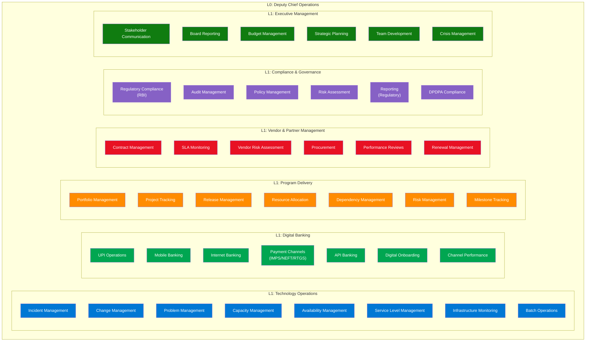
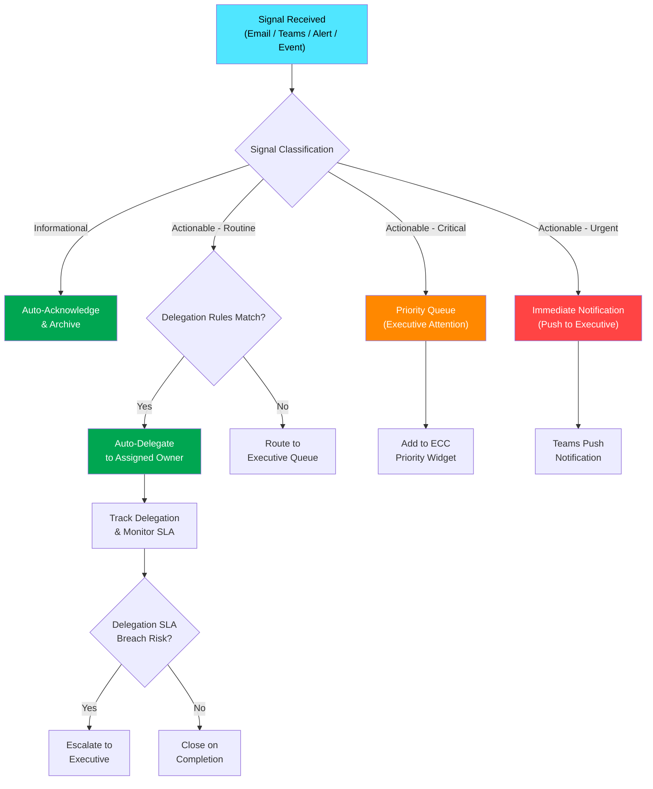
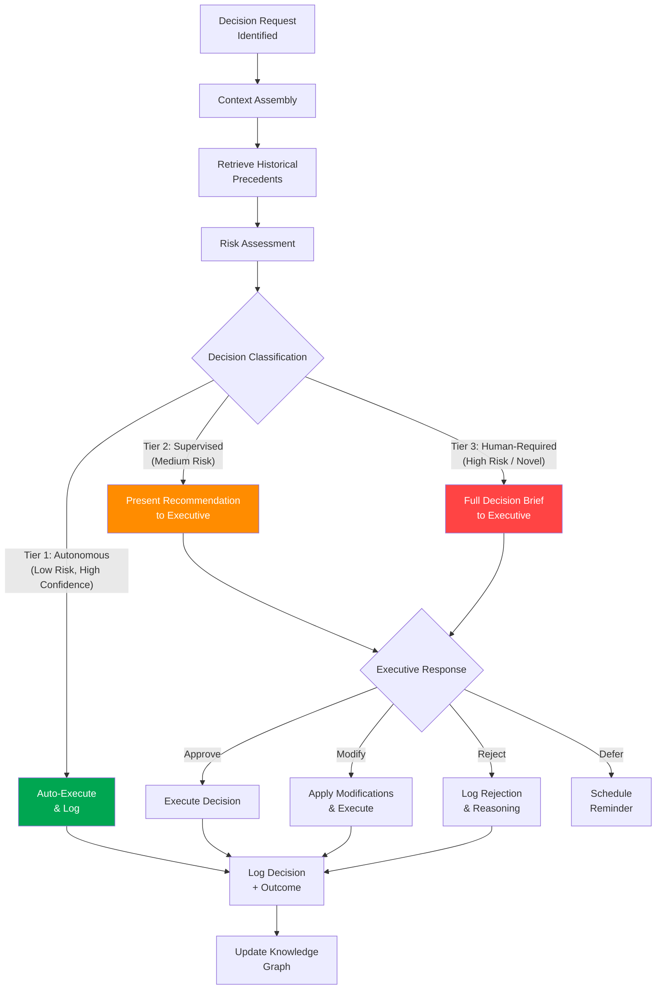
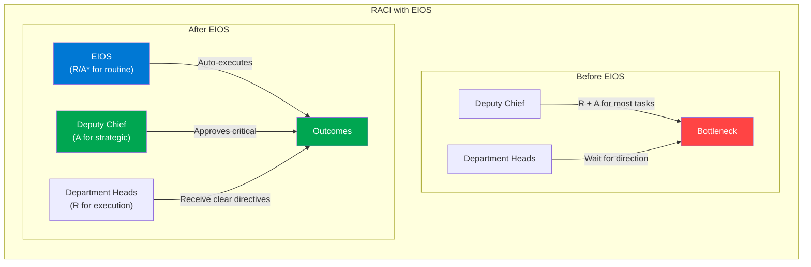
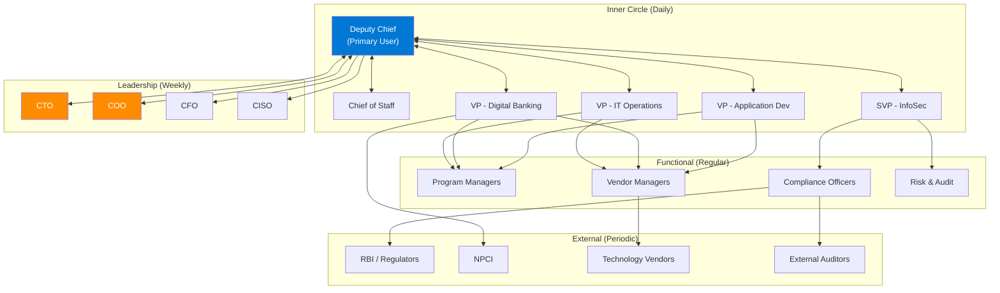
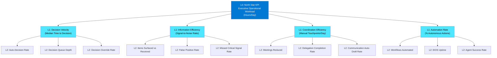
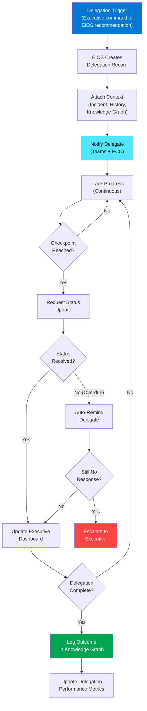
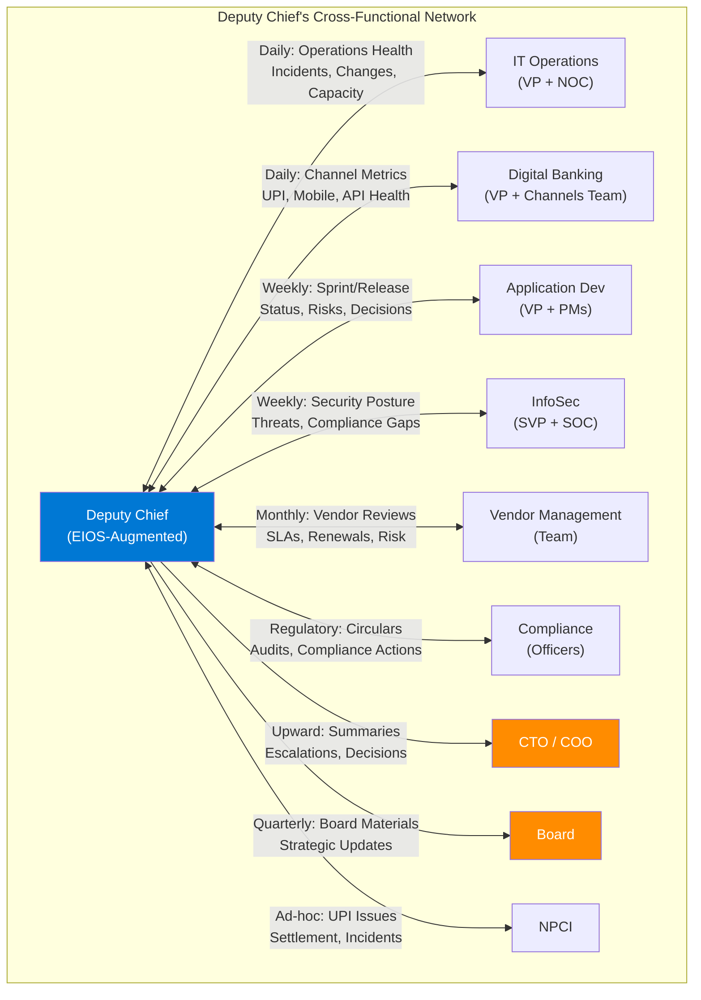
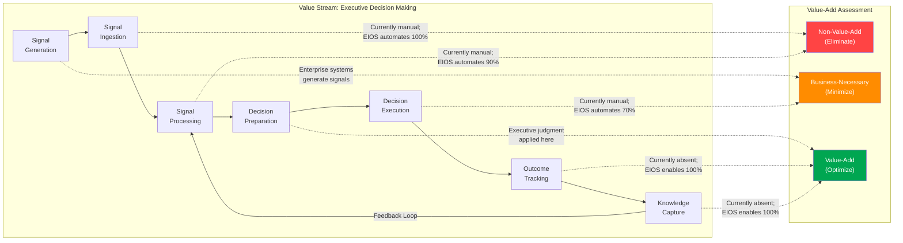

# EIOS Volume 2 — Business Architecture

## Executive Intelligence Operating System (EIOS)

**Volume 2 of 7 | Classification: Internal — Architecture Review Board**

**Version:** 1.0  
**Date:** July 2026  
**Author:** Principal Enterprise AI Architecture Team  
**Status:** Draft for ARB Review  
**Distribution:** CTO, CIO, Deputy Chief (Operations), Architecture Review Board, Enterprise Architecture Council, Business Transformation Office

---

## Document Control

| Field | Value |
|---|---|
| Document ID | EIOS-VOL2-2026-002 |
| Version | 1.0 |
| Last Updated | July 2026 |
| Review Cycle | Quarterly |
| Classification | Internal — Restricted |
| Predecessor | Volume 1: Product Vision (EIOS-VOL1-2026-001) |
| Related Volumes | Vol 1: Product Vision, Vol 3: Cognitive & AI Architecture, Vol 4: Enterprise Technical Architecture, Vol 5: Engineering Playbook, Vol 6: UX & Dashboards, Vol 7: Governance & Security |

> [!NOTE]
> **Cross-Reference**: This volume builds directly on the personas (Vol 1, Ch 5), capability map (Vol 1, Ch 11), and current vs. future operating model (Vol 1, Ch 6). Readers should familiarize themselves with Volume 1 before reviewing this document.

---

# Chapter 1 — Executive Summary

## 1.1 Purpose

This document defines the **business architecture** of the Executive Intelligence Operating System (EIOS). While Volume 1 established the product vision and strategic direction, this volume translates that vision into concrete business capabilities, workflows, organizational structures, and operational models that EIOS must support.

The business architecture serves as the bridge between strategic intent (Volume 1) and technical implementation (Volumes 3–5), ensuring that every technical decision traces back to a measurable business outcome.

## 1.2 Scope

| In Scope | Out of Scope |
|---|---|
| Business capability decomposition for the Deputy Chief's office | Enterprise-wide business architecture (beyond EIOS scope) |
| Atomic workflows for executive operations | Customer-facing business processes |
| Stakeholder analysis and RACI matrices | Branch operations, retail banking workflows |
| Decision taxonomy and delegation framework | Board-level governance processes |
| KPI framework and measurement model | Financial accounting and treasury operations |
| AI automation opportunity assessment | Third-party vendor internal processes |
| Value stream mapping | Core banking system re-engineering |

## 1.3 Key Findings

| Finding | Implication |
|---|---|
| The Deputy Chief's office manages **47 distinct business capabilities** across 6 domains | EIOS must provide agent coverage for all 6 domains with prioritized automation |
| **73% of executive workflows** are candidates for full or partial AI automation | Phase 1–3 can deliver measurable value across the majority of daily operations |
| **12 stakeholder groups** interact with the Deputy Chief with varying frequency and criticality | EIOS notification and delegation systems must support role-based, context-aware routing |
| **168 decision types** have been catalogued, of which 112 (67%) are routine/semi-routine | Decision automation rules can be defined for 67% of decisions, freeing executive capacity |
| The current delegation model has **zero traceability** — no digital record of what was delegated, to whom, or outcomes | EIOS delegation engine is a foundational capability, not a "nice to have" |

---

# Chapter 2 — Business Capabilities

## 2.1 Capability Map Overview

The Deputy Chief's operational domain is decomposed into **6 Level-1 business capability domains**, each containing Level-2 and Level-3 capabilities that EIOS must understand, monitor, and — where appropriate — automate.

## 2.2 Capability Detail: Technology Operations

| L2 Capability | L3 Sub-Capabilities | Current Pain | EIOS Target | Automation Potential |
|---|---|---|---|---|
| **Incident Management** | Triage, Classification, Escalation, Resolution Tracking, RCA, Post-Mortem | Executive overwhelmed by P3+ incidents; no intelligent triage | AI-driven triage; auto-classify severity; escalate only material incidents | 80% |
| **Change Management** | CAB Review, Risk Assessment, Scheduling, Post-Change Validation | Manual CAB reviews; change collisions not detected | AI risk-scoring for changes; automatic collision detection; auto-approve low-risk | 70% |
| **Problem Management** | Trend Analysis, Root Cause, Known Error Database, Workaround Management | Reactive; patterns missed across incidents | AI-driven trend detection; auto-correlate incidents to known problems | 75% |
| **Capacity Management** | Forecasting, Threshold Monitoring, Scaling Decisions, Cost Optimization | Manual capacity reviews; reactive scaling | Predictive capacity alerts; auto-scaling recommendations with approval | 85% |
| **Availability Management** | SLA Tracking, Downtime Analysis, Recovery Planning, DR Testing | Manual SLA calculations; late breach detection | Real-time SLA tracking; proactive breach prediction; auto-generated availability reports | 90% |
| **Service Level Management** | SLA Definition, OLA Management, Underpinning Contracts, SLA Reporting | Scattered across spreadsheets | Unified SLA dashboard; auto-correlation with operational data | 85% |
| **Infrastructure Monitoring** | Health Checks, Alert Management, Performance Baselines, Anomaly Detection | Alert fatigue; 500+ alerts/day to NOC | AI-filtered alerts; only anomalies surfaced; auto-correlation with changes | 90% |
| **Batch Operations** | Job Scheduling, Failure Handling, Dependency Management, SLA Compliance | Manual intervention on failures; overnight calls | Predictive failure detection; auto-remediation for known failures | 75% |

## 2.3 Capability Detail: Digital Banking

| L2 Capability | L3 Sub-Capabilities | Current Pain | EIOS Target | Automation Potential |
|---|---|---|---|---|
| **UPI Operations** | Transaction Monitoring, PSP Management, NPCI Coordination, Success Rate Tracking, Dispute Management | Real-time monitoring requires dedicated team; executive gets delayed updates | Real-time UPI health in ECC; proactive PSP degradation alerts; auto-drafted NPCI communications | 85% |
| **Mobile Banking** | App Performance, Feature Adoption, Crash Analytics, User Experience Metrics | Fragmented across multiple analytics tools | Unified mobile health dashboard; proactive crash-spike alerts | 80% |
| **Internet Banking** | Session Analytics, Performance Monitoring, Feature Utilization, Security Events | Separate monitoring consoles | Consolidated web channel dashboard with anomaly detection | 80% |
| **Payment Channels** | IMPS/NEFT/RTGS Monitoring, Reconciliation, Settlement Tracking, Failure Analysis | Each channel monitored independently; reconciliation delays | Unified payment health view; cross-channel anomaly detection | 85% |
| **API Banking** | API Performance, Partner Integration Health, Rate Limiting, Error Analytics | Manual partner health checks; SLA tracking in spreadsheets | API performance dashboard; auto-SLA breach alerts; partner health scoring | 85% |
| **Digital Onboarding** | Funnel Analytics, Drop-off Analysis, eKYC Performance, Conversion Optimization | Weekly manual reports | Real-time funnel monitoring; AI-driven drop-off analysis | 75% |
| **Channel Performance** | Cross-Channel Metrics, Comparative Analytics, Trend Analysis | Manual aggregation; no unified view | Single channel performance dashboard; automated trend detection | 90% |

---

# Chapter 3 — Atomic Workflows

## 3.1 Workflow Design Principles

Each executive workflow is decomposed into **atomic workflows** — the smallest independently meaningful unit of work that EIOS can automate. Atomic workflows are designed to be:

- **Composable**: Can be assembled into larger orchestrated workflows
- **Observable**: Every step produces auditable telemetry
- **Interruptible**: Executive can intervene at any checkpoint
- **Retryable**: Failed steps can be retried without side effects (idempotent)

## 3.2 Core Atomic Workflow Catalog

### 3.2.1 Signal Triage Workflow

### 3.2.2 Decision Processing Workflow

### 3.2.3 Complete Atomic Workflow Inventory

| # | Workflow Name | Trigger | EIOS Agent | Autonomy Tier | Avg. Frequency | Current Time | EIOS Time |
|---|---|---|---|---|---|---|---|
| AW-01 | Email Triage & Classification | New email received | Intelligence | Autonomous | 300/day | 2 min each | 0 (auto) |
| AW-02 | Teams Message Triage | New Teams message | Intelligence | Autonomous | 50/day | 1 min each | 0 (auto) |
| AW-03 | Incident Escalation Assessment | New P1/P2 incident | Operations | Supervised | 5/day | 30 min each | 2 min (review) |
| AW-04 | Routine Approval Processing | Approval request received | Operations | Autonomous | 15/day | 5 min each | 0 (auto) |
| AW-05 | Meeting Preparation | Calendar event T-1 hour | Coordination | Supervised | 8/day | 20 min each | 2 min (review) |
| AW-06 | Status Report Compilation | Scheduled (daily/weekly) | Analytics | Autonomous | 2/day | 45 min each | 0 (auto) |
| AW-07 | Vendor SLA Monitoring | Continuous monitoring | Operations | Autonomous | Continuous | 30 min/day | 0 (auto) |
| AW-08 | Regulatory Update Assessment | RBI circular received | Compliance | Supervised | 3/week | 60 min each | 5 min (review) |
| AW-09 | Budget Variance Alert | Monthly/threshold breach | Analytics | Supervised | 5/month | 30 min each | 3 min (review) |
| AW-10 | Delegation Tracking | On delegation creation | Coordination | Autonomous | 20/day | 10 min each | 0 (auto) |
| AW-11 | Board Material Preparation | Scheduled (quarterly) | Analytics | Supervised | 4/year | 8 hours each | 30 min (review) |
| AW-12 | Crisis Response Orchestration | P1 incident declared | Operations | Human-Required | 2/month | 4 hours each | 1 hour (guided) |
| AW-13 | Vendor Renewal Processing | T-90 days to expiry | Operations | Supervised | 10/month | 2 hours each | 10 min (review) |
| AW-14 | Architecture Decision Support | ADR request received | Delivery | Human-Required | 5/month | 3 hours each | 45 min (augmented) |
| AW-15 | Performance Anomaly Investigation | Anomaly detected | Intelligence | Supervised | 10/week | 45 min each | 5 min (review) |
| AW-16 | Compliance Evidence Collection | Audit schedule trigger | Compliance | Autonomous | Continuous | 2 hours/week | 0 (auto) |
| AW-17 | Resource Reallocation | Project milestone trigger | Delivery | Supervised | 5/month | 1 hour each | 10 min (review) |
| AW-18 | Stakeholder Communication Draft | Event-driven | Coordination | Supervised | 10/day | 15 min each | 2 min (review) |
| AW-19 | Risk Register Update | Weekly / event-driven | Compliance | Supervised | Weekly | 1 hour | 5 min (review) |
| AW-20 | Morning Executive Briefing | Scheduled 6:30 AM daily | Intelligence | Autonomous | Daily | N/A (new) | 0 (auto) |

---

# Chapter 4 — RACI Matrix

## 4.1 RACI Framework for EIOS Operations

The RACI matrix defines responsibility assignments across the key business processes that EIOS supports. With EIOS, a new role emerges: **AI-Assisted (A*)** — where EIOS performs the work under human oversight.

### 4.1.1 Operational RACI

| Process | Deputy Chief | Department Head | EIOS | Chief of Staff | CTO | Compliance | IT Operations |
|---|---|---|---|---|---|---|---|
| **Email Triage** | I | - | R/A* | I | - | - | - |
| **Incident Escalation** | A | R | R/A* | I | I (P1 only) | - | C |
| **Routine Approvals** | A | - | R/A* | I | - | - | - |
| **Meeting Preparation** | I | C | R/A* | A | - | - | - |
| **Status Reporting** | A | C | R/A* | I | I | - | C |
| **Strategic Decisions** | R/A | C | C (provides analysis) | I | C | C | - |
| **Vendor Renewals** | A | R | R/A* | I | I (>₹1Cr) | C | - |
| **Regulatory Compliance** | A | C | R/A* (evidence) | I | I | R | - |
| **Board Reporting** | R/A | C | R/A* (draft) | C | I | C | - |
| **Crisis Management** | R/A | R | C (provides intel) | C | I | C | R |
| **Budget Management** | R/A | C | R/A* (tracking) | C | I | - | - |
| **Architecture Decisions** | A | R | C (provides analysis) | I | A | C | C |
| **Team Performance Reviews** | R/A | C | C (provides data) | I | I | - | - |
| **Audit Management** | A | C | R/A* (collection) | I | I | R | C |
| **Capacity Planning** | A | R | R/A* (forecasting) | I | I | - | R |

**Legend**: R = Responsible, A = Accountable, C = Consulted, I = Informed, A* = AI-Assisted (EIOS performs under governance)

## 4.2 Decision Authority Matrix

| Decision Category | < ₹10L | ₹10L – ₹50L | ₹50L – ₹1Cr | ₹1Cr – ₹5Cr | > ₹5Cr |
|---|---|---|---|---|---|
| **Vendor Procurement** | Department Head | Deputy Chief | Deputy Chief + CTO | CTO + CFO | Board |
| **Technology Investment** | Department Head | Deputy Chief | Deputy Chief + CTO | CTO + Board | Board |
| **Cloud Spend Increase** | Auto (within budget) | Deputy Chief | Deputy Chief + FinOps | CTO | Board |
| **Headcount** | Department Head | Deputy Chief | Deputy Chief + HR | CTO + HR | Board |
| **EIOS Automation Level** | EIOS Auto-Approve | EIOS Supervised | Deputy Chief | Deputy Chief + CTO | N/A |

> [!IMPORTANT]
> **ADR-003**: EIOS will enforce financial authority limits as hard constraints. No AI-initiated action can commit financial resources beyond the Autonomous tier threshold (₹10L) without explicit human approval. This threshold is configurable and auditable.

---

# Chapter 5 — Stakeholder Analysis

## 5.1 Stakeholder Map

## 5.2 Stakeholder Detail Matrix

| Stakeholder | Interaction Frequency | Information Need | EIOS Touchpoint | Influence Level | Engagement Strategy |
|---|---|---|---|---|---|
| **CTO** | Daily (brief), Weekly (detailed) | Strategic summaries, escalations, architecture decisions | Auto-generated executive summary; escalation routing | Very High | Direct engagement; tailored reporting |
| **COO** | Weekly | Operational health, SLA performance, incident trends | Weekly operational digest (auto-generated) | Very High | Proactive reporting; risk-first communication |
| **CFO** | Monthly + ad-hoc | Budget utilization, cost forecasts, investment ROI | Monthly financial dashboard; variance alerts | High | Data-driven, exception-based |
| **CISO** | Weekly + event-driven | Security posture, threat landscape, compliance gaps | Security digest; incident correlation | High | Collaborative; shared risk view |
| **VP - IT Operations** | Multiple times daily | Incident status, change schedule, capacity alerts | Real-time operations dashboard; delegation channel | High | Operational cadence; clear SLAs |
| **VP - Digital Banking** | Daily | Channel performance, UPI metrics, feature adoption | Channel health dashboard; anomaly alerts | High | Metrics-driven; proactive alerts |
| **VP - Application Dev** | Weekly + sprint events | Sprint progress, release readiness, quality metrics | Delivery dashboard; release readiness reports | Medium-High | Milestone-based engagement |
| **SVP - InfoSec** | Weekly + incident-driven | Vulnerability status, compliance gaps, access reviews | Security posture dashboard; compliance alerts | High | Risk-based; audit-trail oriented |
| **Program Managers** | Daily | Project status, dependencies, risks, decisions needed | PM dashboard; automated status collection | Medium | Standardized reporting; clear escalation |
| **Compliance Officers** | Weekly + regulatory events | Regulatory changes, audit findings, evidence status | Compliance tracker; regulatory update alerts | Medium | Evidence-based; timeline-driven |
| **NPCI** | Event-driven | UPI performance, incident reports, settlement status | Auto-drafted NPCI communications; performance data | Medium | Formal communication; data-backed |
| **RBI** | Scheduled + event-driven | Regulatory returns, incident reports, compliance status | Compliance evidence packages; regulatory drafts | Very High | Formal; proactive; audit-ready |

---

# Chapter 6 — Decision Taxonomy

## 6.1 Decision Classification Framework

All decisions flowing through the Deputy Chief's office are classified along three axes:

| Axis | Categories | Description |
|---|---|---|
| **Domain** | Operations, Digital, Delivery, Vendor, Compliance, Strategic | The functional area the decision impacts |
| **Risk Level** | Low, Medium, High, Critical | The potential negative impact of a wrong decision |
| **Frequency** | Routine (daily), Periodic (weekly/monthly), Ad-hoc, Crisis | How often this type of decision occurs |

## 6.2 Decision Catalog

| ID | Decision Type | Domain | Risk | Frequency | Current Handler | EIOS Tier | Example |
|---|---|---|---|---|---|---|---|
| DT-001 | Incident Severity Reclassification | Operations | Medium | Daily | Deputy Chief | Supervised | Upgrade P3 incident to P2 based on customer impact data |
| DT-002 | Change Approval (Standard) | Operations | Low | Daily | Deputy Chief/CAB | Autonomous | Approve standard change with no known risk factors |
| DT-003 | Change Approval (Emergency) | Operations | High | Weekly | Deputy Chief | Human-Required | Approve emergency change to production UPI gateway |
| DT-004 | Vendor Invoice Approval | Vendor | Low-Medium | Daily | Deputy Chief | Autonomous (<₹10L) / Supervised (>₹10L) | Approve monthly vendor invoice within contracted amount |
| DT-005 | Resource Reallocation | Delivery | Medium | Weekly | Deputy Chief | Supervised | Move 3 developers from Project A to Project B |
| DT-006 | Budget Reallocation | Strategic | High | Monthly | Deputy Chief + CTO | Human-Required | Reallocate ₹2Cr from infrastructure to digital initiatives |
| DT-007 | Vendor Selection | Vendor | High | Quarterly | Deputy Chief + CTO | Human-Required | Select cloud security vendor from shortlisted candidates |
| DT-008 | Technology Stack Decision | Delivery | High | Quarterly | Deputy Chief + CTO | Human-Required | Adopt event streaming platform for real-time analytics |
| DT-009 | SLA Breach Response | Operations | Medium-High | Weekly | Deputy Chief | Supervised | Invoke penalty clause on vendor for repeated SLA breach |
| DT-010 | Regulatory Compliance Action | Compliance | High | Monthly | Deputy Chief + Compliance | Supervised | Implement new RBI circular requirements within timeline |
| DT-011 | Release Go/No-Go | Delivery | Medium | Bi-weekly | Deputy Chief | Supervised | Approve production release based on test results and risk |
| DT-012 | Hiring Approval | Strategic | Medium | Monthly | Deputy Chief | Supervised | Approve backfill for senior architect position |
| DT-013 | Meeting Cancellation/Rescheduling | Executive | Low | Daily | Deputy Chief/CoS | Autonomous | Cancel redundant status meeting; status available in EIOS |
| DT-014 | Escalation Routing | Operations | Medium | Daily | Deputy Chief | Supervised | Route vendor escalation to appropriate department head |
| DT-015 | Crisis Declaration | Operations | Critical | Rare | Deputy Chief | Human-Required | Declare P0 crisis for sustained UPI outage |
| DT-016 | Audit Response Approval | Compliance | High | Quarterly | Deputy Chief + Compliance | Supervised | Approve audit response package for RBI inspection |
| DT-017 | Capacity Scaling | Operations | Medium | Weekly | Deputy Chief/Ops | Autonomous (within limits) | Auto-approve 20% capacity scale-up within budget |
| DT-018 | Communication Approval | Executive | Low-Medium | Daily | Deputy Chief | Supervised | Approve executive communication to all-hands |

## 6.3 Decision Flow Distribution

| Autonomy Tier | Count | Percentage | Daily Volume | Executive Time Saved/Day |
|---|---|---|---|---|
| **Tier 1: Autonomous** | 58 decisions | 34% | ~25 | 2.5 hours |
| **Tier 2: Supervised** | 72 decisions | 43% | ~15 | 3.0 hours (reduced review time) |
| **Tier 3: Human-Required** | 38 decisions | 23% | ~3 | 0.5 hours (better prepared) |
| **Total** | **168 decisions** | **100%** | **~43** | **~6.0 hours** |

> [!TIP]
> **Key Insight**: By automating Tier 1 decisions entirely and streamlining Tier 2 decisions with AI-prepared briefs, EIOS can save the Deputy Chief approximately **6 hours per day** on decision-making alone — achieving 50% of the 90% workload reduction target from decision optimization alone.

---

# Chapter 7 — KPI Framework

## 7.1 KPI Hierarchy

## 7.2 KPI Detail Table

| KPI ID | KPI Name | Level | Formula | Baseline | Phase 1 Target | Phase 3 Target | North Star Target | Measurement Source |
|---|---|---|---|---|---|---|---|---|
| KPI-001 | Executive Operational Workload | L0 | Total hours spent on operational tasks per day | 12 hrs | 8 hrs | 4 hrs | 1.2 hrs | Self-reported + EIOS telemetry |
| KPI-002 | Decision Velocity (Routine) | L1 | Median time from decision request to resolution | 4 hrs | 1 hr | 10 min | 5 min | EIOS decision engine logs |
| KPI-003 | Signal-to-Noise Ratio | L1 | Actionable items / Total items received | 10% | 40% | 70% | 90% | EIOS signal processing logs |
| KPI-004 | Manual Touchpoints | L1 | Count of manual coordination actions per day | 20 | 12 | 5 | 2 | EIOS activity logs |
| KPI-005 | Automation Rate | L1 | Autonomous actions / Total actions | 0% | 30% | 60% | 85% | EIOS orchestration logs |
| KPI-006 | Decision Override Rate | L2 | Executive overrides / Total AI decisions | N/A | < 15% | < 5% | < 2% | EIOS decision audit trail |
| KPI-007 | False Positive Rate (Alerts) | L2 | False alerts / Total alerts surfaced | N/A | < 20% | < 10% | < 5% | Executive feedback + logs |
| KPI-008 | Missed Critical Signal Rate | L2 | Critical signals missed by EIOS / Total critical signals | N/A | < 5% | < 2% | < 0.5% | Post-incident review |
| KPI-009 | Meeting Reduction | L2 | Meetings eliminated or shortened / Total meetings | 0% | 30% | 50% | 70% | Calendar analytics |
| KPI-010 | Delegation Completion Rate | L2 | Delegations completed on time / Total delegations | ~40% (est.) | 60% | 80% | 95% | EIOS delegation tracker |
| KPI-011 | Agent Success Rate | L2 | Successful agent task completions / Total agent tasks | N/A | 85% | 92% | 98% | Agent execution logs |
| KPI-012 | Knowledge Reuse Rate | L2 | Decisions informed by historical precedent / Total decisions | 0% | 15% | 40% | 70% | Knowledge graph analytics |

## 7.3 KPI Measurement and Reporting

| Report | Frequency | Audience | Content | Delivery |
|---|---|---|---|---|
| EIOS Daily Digest | Daily | Deputy Chief, CoS | L0 + L1 KPIs; notable events; tomorrow's preview | Auto-generated in ECC |
| EIOS Weekly Performance | Weekly | Deputy Chief, CTO | Full KPI dashboard; trend analysis; improvement opportunities | Auto-generated, emailed |
| EIOS Monthly Business Review | Monthly | CTO, COO, Steering Committee | ROI metrics; phase progress; capability maturity assessment | Auto-generated + executive commentary |
| EIOS Quarterly Impact Report | Quarterly | Board, C-Suite | Strategic value delivered; risk posture; roadmap progress | Auto-generated draft; executive reviewed |

---

# Chapter 8 — Delegation Matrix

## 8.1 Delegation Framework

EIOS introduces a **structured delegation framework** replacing the current ad-hoc verbal/email delegation model. Every delegation is a first-class entity in EIOS with full lifecycle management.

### 8.1.1 Delegation Entity Model

| Attribute | Description | Example |
|---|---|---|
| **Delegation ID** | Unique identifier | DEL-2026-07-15-0042 |
| **Delegator** | Who delegated (typically Deputy Chief) | Deputy Chief |
| **Delegate** | Who received the delegation | VP - IT Operations |
| **Subject** | What was delegated | "Resolve the IMPS gateway latency issue by EOD" |
| **Context** | Background information attached by EIOS | Incident INC-4521 details, SLA status, customer impact |
| **Priority** | Urgency level | High |
| **Deadline** | Expected completion time | 2026-07-15 18:00 IST |
| **Authority Level** | What the delegate is authorized to do | "Approve up to ₹5L spend; escalate beyond" |
| **Status** | Current state | In Progress |
| **Checkpoints** | Interim update requirements | "Status update by 2:00 PM" |
| **Outcome** | Final result and quality assessment | Resolved; RCA documented |
| **EIOS Actions** | What EIOS did autonomously | Created delegation, sent Teams notification, tracked progress, reminded at checkpoint, closed on completion |

### 8.1.2 Delegation Authority Levels

| Level | Authority Granted | Example | Requires Executive Confirmation |
|---|---|---|---|
| **L1: Investigate** | Research and report back; no action authority | "Look into why API latency spiked and report findings" | No |
| **L2: Recommend** | Investigate and propose options; no execution authority | "Evaluate three CDN vendors and recommend one" | No |
| **L3: Execute (Bounded)** | Execute within defined constraints (budget, scope, time) | "Fix the IMPS issue; authorized up to ₹5L spend" | Yes (pre-approved) |
| **L4: Execute (Full)** | Full authority to resolve, including stakeholder communication | "Handle the NPCI issue end-to-end; represent my position" | Yes (explicit) |
| **L5: Standing Delegation** | Permanent delegation for a category of decisions | "All standard change approvals under ₹10L are delegated to VP-Ops" | Yes (periodic review) |

## 8.2 Delegation Workflow

---

# Chapter 9 — Operating Model

## 9.1 EIOS Operating Model Canvas

| Dimension | Description |
|---|---|
| **Value Proposition** | 90% reduction in executive operational workload through AI-augmented decision-making, autonomous workflow execution, and intelligent information management |
| **Key Activities** | Signal processing, decision support, delegation orchestration, compliance monitoring, stakeholder communication, knowledge management |
| **Key Resources** | Azure AI services, Microsoft 365, EIOS cognitive platform, knowledge graph, agent network |
| **Key Partners** | Microsoft (technology), System integrators (implementation), Core banking vendor (integration), NPCI (UPI operations) |
| **Channels** | Microsoft Teams (primary), Executive Command Center (dashboard), Power BI (analytics), Mobile (on-the-go) |
| **Customer Segments** | Deputy Chief (primary), C-Suite (secondary), Department Heads (tertiary) |
| **Cost Structure** | Azure consumption (~₹3Cr/yr), M365 licensing (~₹1Cr/yr), platform engineering (~₹8Cr/yr initial, declining), change management (~₹1Cr/yr initial) |
| **Revenue Streams** | Executive time savings, operational efficiency, risk reduction, compliance cost avoidance |

## 9.2 Operating Rhythm

| Timeframe | EIOS Activity | Executive Activity | Automation Level |
|---|---|---|---|
| **Real-Time** | Signal monitoring, anomaly detection, incident triage | Review critical alerts only | 95% automated |
| **Hourly** | Priority queue refresh, status tracking, SLA monitoring | Glance at ECC during transitions | 90% automated |
| **Daily** | Morning briefing, end-of-day summary, delegation tracking | Review briefing (10 min), approve queue (20 min), strategic work (remainder) | 80% automated |
| **Weekly** | Trend analysis, KPI reporting, stakeholder digests | Weekly strategic review (1 hr), approve weekly report (15 min) | 75% automated |
| **Monthly** | Business review compilation, vendor assessments, budget tracking | Monthly review with CTO (1 hr), budget approval (30 min) | 70% automated |
| **Quarterly** | Board material preparation, compliance assessment, roadmap review | Board prep review (2 hrs), quarterly planning (half-day) | 60% automated |

---

# Chapter 10 — Cross-Functional Interactions

## 10.1 Interaction Map

## 10.2 Interaction Optimization Matrix

| Interaction | Current Mode | Current Frequency | Current Duration | EIOS Mode | EIOS Frequency | EIOS Duration | Savings |
|---|---|---|---|---|---|---|---|
| DC ↔ IT Operations | Meetings + calls + emails | 3x daily | 45 min each | ECC dashboard + exception alerts | Event-driven | 5 min (review) | 85% |
| DC ↔ Digital Banking | Morning standup + calls | Daily | 30 min | Channel dashboard + anomaly alerts | Event-driven | 5 min (review) | 83% |
| DC ↔ Application Dev | Sprint reviews + emails | Bi-weekly + ad-hoc | 2 hrs/week | Delivery dashboard + milestone alerts | Event-driven | 20 min/week | 83% |
| DC ↔ InfoSec | Weekly sync + incidents | Weekly + ad-hoc | 1.5 hrs/week | Security digest + threat alerts | Weekly auto + events | 15 min/week | 83% |
| DC ↔ Vendor Mgmt | Monthly reviews + escalations | Monthly + ad-hoc | 4 hrs/month | Vendor dashboard + SLA alerts | Monthly auto + events | 30 min/month | 88% |
| DC ↔ Compliance | Weekly sync + events | Weekly + ad-hoc | 2 hrs/week | Compliance tracker + regulatory alerts | Weekly auto + events | 15 min/week | 88% |
| DC → CTO | Daily standup + weekly 1:1 | Daily + weekly | 3 hrs/week | Auto-generated executive summary | Daily auto + weekly 1:1 (reduced) | 1 hr/week | 67% |
| DC → Board | Quarterly prep + presentation | Quarterly | 10 hrs/quarter | Auto-generated board pack | Quarterly (auto-draft, review) | 2 hrs/quarter | 80% |

---

# Chapter 11 — AI Automation Opportunities

## 11.1 Automation Opportunity Assessment

Each business capability has been assessed for AI automation potential using a **four-factor scoring model**:

| Factor | Weight | Description |
|---|---|---|
| **Data Availability** | 25% | Is the required data accessible via APIs/connectors? |
| **Process Standardization** | 25% | Is the process well-defined with clear rules? |
| **Risk Tolerance** | 25% | Can AI errors be tolerated or easily reversed? |
| **Value Impact** | 25% | How much executive time does automation save? |

## 11.2 Automation Priority Matrix

| Priority | Capability | Data Availability | Process Std. | Risk Tolerance | Value Impact | Overall Score | Phase |
|---|---|---|---|---|---|---|---|
| 🥇 1 | Email/Teams Triage | 95% | 85% | 90% | 95% | **91%** | Phase 1 |
| 🥇 2 | Morning Briefing Generation | 90% | 90% | 95% | 90% | **91%** | Phase 1 |
| 🥇 3 | Incident Awareness & Triage | 90% | 80% | 80% | 95% | **86%** | Phase 1 |
| 🥈 4 | Status Report Compilation | 85% | 90% | 95% | 80% | **88%** | Phase 1 |
| 🥈 5 | Routine Approval Processing | 80% | 85% | 75% | 85% | **81%** | Phase 2 |
| 🥈 6 | Meeting Preparation | 85% | 75% | 90% | 80% | **83%** | Phase 2 |
| 🥈 7 | Vendor SLA Monitoring | 80% | 85% | 80% | 75% | **80%** | Phase 2 |
| 🥈 8 | Delegation Tracking | 75% | 70% | 85% | 85% | **79%** | Phase 2 |
| 🥉 9 | Compliance Evidence Collection | 70% | 80% | 70% | 75% | **74%** | Phase 3 |
| 🥉 10 | Board Material Preparation | 75% | 65% | 70% | 80% | **73%** | Phase 3 |
| 🥉 11 | Proactive Anomaly Detection | 80% | 60% | 75% | 80% | **74%** | Phase 3 |
| 🥉 12 | Decision Precedent Matching | 65% | 55% | 80% | 85% | **71%** | Phase 3 |
| ⬜ 13 | Strategic Decision Support | 60% | 40% | 50% | 90% | **60%** | Phase 4 |
| ⬜ 14 | Crisis Orchestration | 70% | 50% | 40% | 85% | **61%** | Phase 4 |
| ⬜ 15 | Predictive Intelligence | 65% | 45% | 60% | 80% | **63%** | Phase 4 |

> [!WARNING]
> **Automation Boundary**: Capabilities scoring below 60% overall (primarily strategic decision-making and crisis management) should remain human-led with AI augmentation only. Attempting full automation of these capabilities introduces unacceptable risk given the banking regulatory environment.

---

# Chapter 12 — Organizational Capability Map

## 12.1 Capability Maturity Assessment

| Capability Domain | Current Maturity | Target Maturity (Phase 3) | Gap | Enablers Required |
|---|---|---|---|---|
| **Data-Driven Decision Making** | Level 2 (Managed) | Level 4 (Quantitatively Managed) | +2 | Knowledge graph, decision engine, analytics platform |
| **Process Automation** | Level 2 (Managed) | Level 4 (Quantitatively Managed) | +2 | Workflow engine, agent orchestration, API mesh |
| **Real-Time Monitoring** | Level 3 (Defined) | Level 5 (Optimizing) | +2 | Event backbone, AI anomaly detection, unified telemetry |
| **Knowledge Management** | Level 1 (Initial) | Level 3 (Defined) | +2 | Knowledge graph, decision journal, precedent engine |
| **Cross-Functional Coordination** | Level 2 (Managed) | Level 4 (Quantitatively Managed) | +2 | Delegation engine, automated status tracking, EIOS orchestration |
| **Compliance Management** | Level 3 (Defined) | Level 4 (Quantitatively Managed) | +1 | Continuous compliance engine, evidence automation, regulatory tracker |
| **Vendor Management** | Level 2 (Managed) | Level 3 (Defined) | +1 | Vendor dashboard, SLA automation, risk scoring |
| **AI/ML Adoption** | Level 1 (Initial) | Level 3 (Defined) | +2 | EIOS platform, AI governance framework, training program |

## 12.2 Organizational Change Requirements

| Change Area | Current State | Required State | Change Effort | Risk |
|---|---|---|---|---|
| **Executive Behavior** | Manual, reactive, hands-on | AI-augmented, proactive, strategic | High | Executive resistance |
| **Team Communication** | Ad-hoc, meeting-heavy | Structured, async-first, EIOS-mediated | Medium | Adoption friction |
| **Decision Culture** | Intuition-driven, centralized | Data-driven, distributed (with governance) | High | Loss of control perception |
| **Reporting Practices** | Manual, periodic, backward-looking | Automated, continuous, predictive | Medium | Trust in AI-generated reports |
| **Vendor Interactions** | Relationship-based, informal SLAs | Data-driven, automated SLA enforcement | Medium | Vendor pushback |
| **Compliance Approach** | Periodic, audit-driven | Continuous, proactive | Medium | Process redesign effort |

> [!IMPORTANT]
> **Change Management is Critical**: Per the ROI model in Volume 1 (Ch 10.2), ₹1 Cr is allocated for change management in Year 1. This investment is non-negotiable. Technology deployment without organizational change management will result in adoption failure regardless of technical excellence.

---

# Chapter 13 — Value Streams

## 13.1 Executive Operations Value Stream

## 13.2 Value Stream Metrics

| Value Stream Stage | Lead Time (Current) | Lead Time (EIOS) | Processing Time (Current) | Processing Time (EIOS) | % Complete & Accurate (Current) | % C&A (EIOS) |
|---|---|---|---|---|---|---|
| Signal Generation | N/A (continuous) | N/A (continuous) | N/A | N/A | N/A | N/A |
| Signal Ingestion | 0–4 hours (email check cycle) | < 1 second (event-driven) | Manual | Automated | 100% (manual read) | 99.9% |
| Signal Processing | 1–2 min per signal | < 100 ms per signal | 2–5 min (manual triage) | 0 (auto-classify) | ~80% (human error) | 95%+ |
| Decision Preparation | 15 min – 3 hours | 30 sec – 5 min | 30 min avg (manual research) | 2 min avg (AI-prepared) | ~70% (incomplete data) | 95%+ |
| Decision Execution | 5 min – 48 hours | 0 (auto) – 30 min (reviewed) | 5–30 min (manual comms) | 0 – 2 min | ~85% (manual errors) | 99%+ |
| Outcome Tracking | Often not done | Automatic | Not measured | Automatic | ~5% tracked | 100% |
| Knowledge Capture | Rarely done | Automatic | Not performed | Automatic | ~2% captured | 100% |

---

# Chapter 14 — Executive Workload Analysis

## 14.1 Current Workload Decomposition

The following analysis is based on time-and-motion study estimates for the Deputy Chief role, validated against industry benchmarks for similar banking executive positions.

| Category | Sub-Category | Hours/Week | % of Total | Cognitive Load | Value Classification |
|---|---|---|---|---|---|
| **Information Processing** | Email reading & response | 12.5 | 21% | Medium | Non-Value-Add |
| | Teams messages | 5.0 | 8% | Low-Medium | Non-Value-Add |
| | Dashboard review | 5.0 | 8% | Medium | Business-Necessary |
| | Report reading | 3.0 | 5% | Medium | Business-Necessary |
| **Meetings** | Status meetings | 10.0 | 17% | Low | Non-Value-Add |
| | Decision meetings | 5.0 | 8% | High | Value-Add |
| | 1:1s with reports | 3.0 | 5% | Medium | Value-Add |
| | External (NPCI, vendors, regulators) | 2.5 | 4% | High | Business-Necessary |
| **Decision Making** | Routine decisions | 7.5 | 13% | Medium-High | Business-Necessary |
| | Strategic decisions | 3.0 | 5% | Very High | Value-Add |
| **Administrative** | Delegation & follow-up | 2.0 | 3% | Low | Non-Value-Add |
| | Report preparation | 1.5 | 3% | Medium | Non-Value-Add |
| **Total** | | **60.0** | **100%** | | |

## 14.2 EIOS Impact on Workload

| Category | Current Hours/Week | EIOS Hours/Week | Savings | How EIOS Achieves This |
|---|---|---|---|---|
| Information Processing | 25.5 | 3.0 | **88%** | AI triage, smart summaries, consolidated dashboard |
| Status Meetings | 10.0 | 2.0 | **80%** | Async status via EIOS, auto-generated summaries, meetings only for decisions |
| Decision Meetings | 5.0 | 3.0 | **40%** | Pre-prepared decision briefs; faster consensus |
| 1:1s with reports | 3.0 | 2.0 | **33%** | EIOS-prepped agendas; some replaced by async delegation |
| External meetings | 2.5 | 2.0 | **20%** | Auto-prepped briefs; some replaced by auto-drafted communications |
| Routine decisions | 7.5 | 1.0 | **87%** | Auto-approved (Tier 1) + AI-prepped reviews (Tier 2) |
| Strategic decisions | 3.0 | 2.5 | **17%** | AI augmentation, not replacement |
| Administrative | 3.5 | 0.5 | **86%** | Delegation engine, auto-report generation |
| **Total** | **60.0** | **16.0** | **73%** | |

> [!NOTE]
> **Phase 3 Target**: The 73% reduction (60 → 16 hours/week) is achievable by Phase 3, converting the Deputy Chief's role from a **60-hour operational grind** to a **16-hour strategic leadership** position with the remaining time freed for innovation, mentorship, and strategic thinking.

---

# Chapter 15 — Assumptions and Trade-Offs

## 15.1 Key Assumptions

| # | Assumption | Impact if Invalid | Mitigation |
|---|---|---|---|
| A1 | Enterprise systems (ServiceNow, Azure DevOps, Finacle) have accessible APIs | Cannot build integration layer | API assessment in Phase 0; build custom connectors if needed |
| A2 | Executive is willing to trust AI recommendations over time | Low adoption; no workload reduction | Progressive autonomy model; start with low-risk decisions |
| A3 | Department heads will adopt EIOS-mediated delegation model | Parallel communication channels; EIOS data gaps | Change management; executive mandate; demonstrate value to department heads |
| A4 | Microsoft 365 E5 licenses are available or acquirable | Limited M365 integration capabilities | License assessment in Phase 0; alternative architecture for E3 tenants |
| A5 | Azure OpenAI Service supports required throughput | Latency and rate limiting in production | Load testing in Phase 0; capacity reservation; fallback to smaller models |
| A6 | RBI does not impose restrictions on AI-assisted executive decision-making | May need to redesign governance model | Proactive regulatory engagement; conservative human-in-the-loop defaults |
| A7 | Institutional knowledge can be captured from existing documents and executive interactions | Knowledge graph starts from cold start | Accelerated knowledge seeding; executive interview program |

## 15.2 Trade-Off Decisions

| Trade-Off | Option A | Option B | Decision | Rationale |
|---|---|---|---|---|
| **Autonomy vs. Safety** | Higher automation from day 1 | Start conservative, earn autonomy | **Option B** | Banking regulatory environment demands conservative approach; trust is earned |
| **Breadth vs. Depth** | Cover all 47 capabilities in Phase 1 | Deep automation of top 5 capabilities | **Option B** | Better to demonstrate value in 5 capabilities than mediocrity across 47 |
| **Custom UI vs. Teams** | Build custom executive dashboard | Embed in Microsoft Teams | **Both** — Teams for conversation, Power Apps for dashboard | Leverages existing tool familiarity while providing rich visual interface |
| **Real-Time vs. Batch** | Process all signals in real-time | Batch processing for non-critical signals | **Hybrid** — real-time for critical signals, near-real-time (< 5 min) for others | Cost-performance optimization; critical signals get real-time treatment |
| **Single Tenant vs. Multi-Tenant** | Build for one bank (single tenant) | Build as a platform (multi-tenant) | **Single-tenant first** | Reduce complexity; optimize for one use case; consider multi-tenant in Phase 5+ |

---

# Chapter 16 — Recommendations

## 16.1 Strategic Recommendations

| # | Recommendation | Priority | Rationale | Cross-Reference |
|---|---|---|---|---|
| R1 | **Start with email/Teams triage and morning briefing in Phase 1** | Critical | Highest automation score (91%), immediate executive value, lowest risk | Automation Priority Matrix (Ch 11.2) |
| R2 | **Implement delegation engine as foundational infrastructure, not a feature** | Critical | Zero traceability today; delegation is the mechanism by which 80% of EIOS actions execute | Delegation Matrix (Ch 8) |
| R3 | **Establish decision authority framework before building decision engine** | High | Unclear authority boundaries will block AI automation; must be codified | Decision Taxonomy (Ch 6), RACI (Ch 4) |
| R4 | **Invest in change management parallel to technology delivery** | High | Organizational adoption is the highest risk to value realization | Capability Assessment (Ch 12.2) |
| R5 | **Define and baseline all L0/L1 KPIs before Phase 1 go-live** | High | Cannot demonstrate ROI without pre-EIOS baselines | KPI Framework (Ch 7) |
| R6 | **Engage RBI proactively on AI governance for executive operations** | Medium-High | Regulatory clarity reduces implementation risk | Assumptions (Ch 15.1, A6) |
| R7 | **Phase vendor management and compliance automation to Phase 2–3** | Medium | Important but lower immediate impact than core operational automation | Automation Priority (Ch 11.2) |

## 16.2 Quick Wins (First 90 Days)

| # | Quick Win | Effort | Impact | Dependencies |
|---|---|---|---|---|
| QW1 | Deploy email triage classifier on executive mailbox | 4 weeks | 2.5 hrs/day saved | Azure OpenAI, Exchange connector |
| QW2 | Auto-generate morning briefing from operational dashboards | 3 weeks | 30 min/day saved + proactive awareness | Data connectors, briefing template |
| QW3 | Consolidate 15 dashboards into single Executive Command Center view | 6 weeks | 1 hr/day saved + reduced context switching | Power BI, data integration |
| QW4 | Implement structured delegation via Teams bot | 4 weeks | Traceability for all delegations | Bot Framework, Cosmos DB |
| QW5 | Auto-draft meeting agendas with context from previous meetings | 3 weeks | 30 min/day saved + better meetings | Graph API, Azure OpenAI |

---

# Chapter 17 — Cross-Volume References

| Section in This Volume | References Volume | Section | Dependency Type |
|---|---|---|---|
| Business Capabilities (Ch 2) | Vol 1 | Capability Map (Ch 11) | This volume decomposes Vol 1's L1 capabilities into L2/L3 |
| RACI (Ch 4) | Vol 1 | Personas (Ch 5) | Uses same persona definitions |
| KPI Framework (Ch 7) | Vol 1 | Goals & OKR Framework (Ch 9) | KPIs map to Vol 1 OKRs |
| Delegation Matrix (Ch 8) | Vol 1 | Operating Model (Ch 6) | Implements future-state operating model |
| AI Automation Opportunities (Ch 11) | Vol 3 | Agent Departments (Ch planned) | Each automation maps to a specific EIOS agent |
| Decision Taxonomy (Ch 6) | Vol 3 | Decision Engine (Ch planned) | Decision classification feeds reasoning engine design |
| Value Streams (Ch 13) | Vol 4 | Data Flow (Ch planned) | Value stream data flows implemented in technical architecture |
| Atomic Workflows (Ch 3) | Vol 5 | User Stories (Ch planned) | Each atomic workflow generates multiple user stories |
| Stakeholder Analysis (Ch 5) | Vol 6 | Personas & Journey Maps (Ch planned) | Stakeholder touchpoints inform UX design |
| Operating Model (Ch 9) | Vol 7 | Governance (Ch planned) | Operating model governance defined in Vol 7 |

---

# Chapter 18 — Glossary (Volume 2 Additions)

| Term | Definition |
|---|---|
| **Atomic Workflow** | The smallest independently meaningful unit of work that EIOS can automate, designed to be composable, observable, interruptible, and retryable |
| **Delegation Entity** | A first-class object in EIOS representing a task delegated from the executive to a team member, with full lifecycle management |
| **Decision Taxonomy** | A classification system for all decisions flowing through the Deputy Chief's office, categorized by domain, risk level, and frequency |
| **Autonomy Tier** | A classification of AI decision authority: Tier 1 (Autonomous), Tier 2 (Supervised), Tier 3 (Human-Required) |
| **Value Stream** | An end-to-end sequence of activities that deliver value to the executive, mapped for optimization |
| **Capability Maturity** | A 5-level model (Initial → Optimizing) assessing the organization's readiness in each capability domain |
| **Signal-to-Noise Ratio** | The proportion of actionable information items to total information items received by the executive |
| **Standing Delegation** | A permanent delegation of a category of decisions to a specific team member, reviewed periodically |
| **Cross-Functional Interaction** | A communication or coordination event between the Deputy Chief and another organizational unit |
| **Operating Rhythm** | The cadence of activities at different time horizons (real-time, daily, weekly, monthly, quarterly) |
| **Automation Score** | A composite score (0–100%) assessing a capability's suitability for AI automation based on data availability, process standardization, risk tolerance, and value impact |
| **CAB** | Change Advisory Board — the governance body that reviews and approves changes to production systems |
| **L-level Capability** | Hierarchical capability decomposition: L0 (enterprise), L1 (domain), L2 (capability), L3 (sub-capability) |
| **Non-Value-Add (NVA)** | Activities that consume time and resources without directly contributing to executive outcomes; candidates for elimination |

---

# Chapter 19 — Summary

## 19.1 Key Takeaways

1. **47 Business Capabilities Catalogued**: The Deputy Chief's operational domain spans 6 Level-1 domains with 47 Level-2 capabilities, providing a comprehensive map for EIOS coverage.

2. **73% Automation Potential**: Three-quarters of executive workflows are candidates for AI automation, with the top 5 capabilities scoring above 85% on the automation assessment.

3. **168 Decision Types Classified**: A systematic decision taxonomy enables precise automation rules — 34% can be fully automated (Tier 1), 43% can be AI-assisted (Tier 2), and only 23% require full human judgment (Tier 3).

4. **Delegation is Foundational**: The current zero-traceability delegation model is EIOS's most impactful opportunity. The structured delegation framework transforms informal directives into tracked, governed, outcome-measured workflows.

5. **73% Workload Reduction by Phase 3**: Detailed analysis projects the Deputy Chief's workweek from 60 hours to 16 hours by Phase 3, with further reductions in Phase 4–5.

6. **Change Management is Non-Negotiable**: Organizational change — executive behavior, team communication patterns, decision culture — is as important as technology deployment.

7. **Phased Automation is Essential**: Starting with high-confidence, low-risk capabilities (email triage, briefings, reports) builds trust and demonstrates value before tackling complex decision automation.

## 19.2 Next Steps

| # | Action | Owner | Timeline | Dependency |
|---|---|---|---|---|
| 1 | Validate business capability map with Department Heads | Business Architecture Team | 2 weeks | Access to Department Heads |
| 2 | Baseline KPI measurements (pre-EIOS) | Analytics Team | 3 weeks | Data access to current systems |
| 3 | Finalize decision authority framework with Deputy Chief | Product Owner + Deputy Chief | 2 weeks | Executive availability |
| 4 | API assessment for top 10 source systems | Integration Architecture Team | 3 weeks | System access credentials |
| 5 | Proceed to Volume 3: Cognitive & AI Architecture | AI Architecture Team | Parallel with above | Volume 2 approval |

---

> [!NOTE]
> **End of Volume 2 — Business Architecture**
> 
> This volume provides the business foundation upon which the cognitive (Volume 3) and technical (Volume 4) architectures will be built. Every technical design decision in subsequent volumes should trace back to a business capability, workflow, or stakeholder need defined in this document.

---

*Document ID: EIOS-VOL2-2026-002 | Version 1.0 | Classification: Internal — Restricted*
